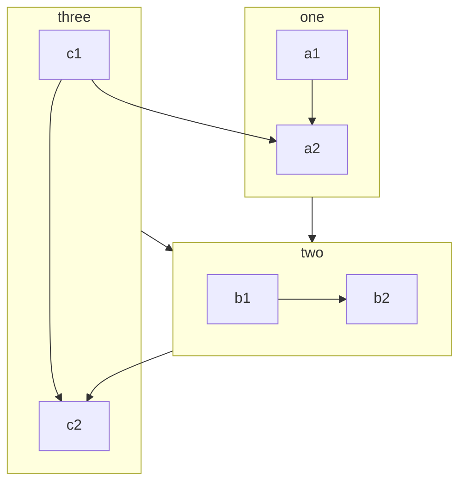
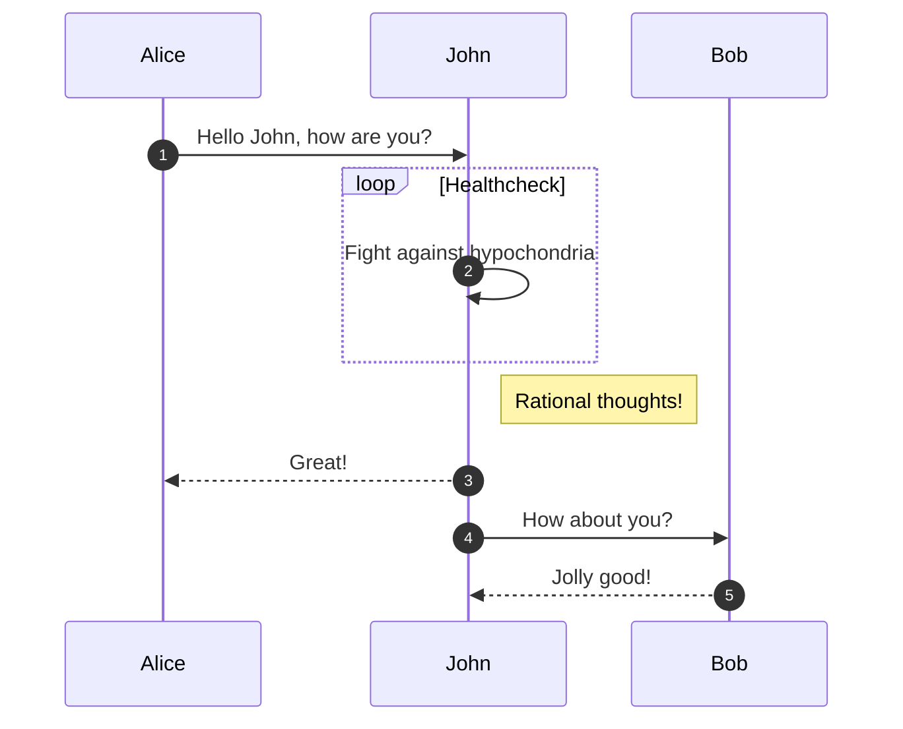
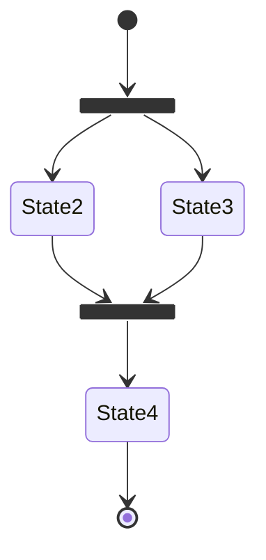
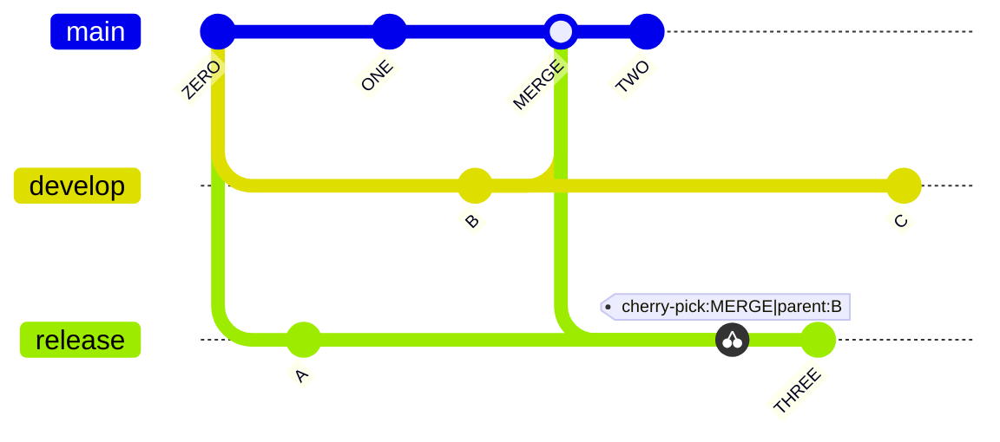

文字だけで見ると難しそうなことでも、図に起こしてみることで構造を単純化できることは多々ある。
そのため、頭で考えるだけではなく、思考を視覚化する癖をつけたい。

そんなときに有効なツールとして [Mermaid](https://mermaid.js.org) がある。
フローチャートやシーケンス図など様々なダイアグラムの生成をサポートしている。

[draw.io](https://www.drawio.com) のような作図ツールとは違い、Markdown と同様にテキストからダイアグラムを生成できるのが特徴である。
もちろん、GUI で作図するのとは異なり、スタイルのリッチさでは劣るが抽象的に考えるにはそのほうがむしろ好都合なこともある。

Mermaid が何より素晴らしいのは、図を更新するために GUI を開いて、エクスポートしてといった煩わしい作業に時間を取られない点だろう。
テキストを数文字変えるだけで済む。
あとは、ちょっと線がずれたりしてストレスが溜まるといったこともない。

さて、このブログではロジカルな部分はできるだけ図や表にしてわかりやすくしたい。
そこで MDX ファイル内で Mermaid 記法を使えるようにした（v1.4.10）。

https://github.com/kkhys/me/issues/493

## 実装方法

[rehype-mermaid](https://github.com/remcohaszing/rehype-mermaid) というドンピシャなライブラリを使った。

このライブラリの良いところはインライン SVG の生成をビルド時に行ってくれることである。
内部的に [Playwright](https://playwright.dev) のヘッドレスブラウザを使っているようだ。

<Alert type='warning' description='CI 環境ではビルドが不安定になる現象が何度か観測されている。デバッグに自信がなければ rehype-mermaid の使用は控えた方が良さそう。' />

Mermaid の描画は通常クライアント（ブラウザ）側で行われるが、その際にノードの数が多くなればなるほど負荷が高くなってしまう。
リンクカードのときもそうだったが、可能な限り SSG でページを生成してパフォーマンスを良くしたい。

とりあえず使うだけなら以下のように `rehypePlugins` に追加するだけで良い。
この際の注意点として、[rehype-pretty-code](https://github.com/rehype-pretty/rehype-pretty-code) などのシンタックスハイライト系のプラグインを使っている場合は、それよりも前に定義する必要がある。

```ts title="contentlayer.config.ts" showLineNumbers {6}
import rehypeMermaid from 'rehype-mermaid';

export default makeSource({
  mdx: {
    rehypePlugins: [
      [rehypeMermaid]
    ],
  },
});
```

デフォルトの機能だけでも十分だが、デザイン面で気に入らない部分があったので調整した。

`rehype-mermaid` の設定は変更していない。
変更したのは Mermaid 公式の設定のみ。

https://mermaid.js.org/config/schema-docs/config.html

公式ドキュメントを見てもいまいちオプションが分からなかったが、幸いにも TypeScript の型定義がされていたのでそれを元に以下のように設定ファイルを書いた。

```ts title="src/lib/mdx/rehype-mermaid.ts" showLineNumbers
import type { RehypeMermaidOptions } from 'rehype-mermaid';

const mermaidConfig = {
  theme: 'base',
  fontFamily:
    'ui-sans-serif, system-ui, sans-serif, "Apple Color Emoji", "Segoe UI Emoji", "Segoe UI Symbol", "Noto Color Emoji"',
  fontSize: 13,
  themeVariables: {
    primaryColor: '#b0b0b0',
    secondaryColor: '#545480',
    primaryBorderColor: '#4c4c53',
    primaryTextColor: '#f4f4f5',
    secondaryTextColor: '#f4f4f5',
    lineColor: '#4c4c53',
    textColor: '#f4f4f5',
    ...
  },
} satisfies RehypeMermaidOptions['mermaidConfig'];

export const rehypeMermaidOptions = {
  mermaidConfig,
} satisfies RehypeMermaidOptions;
```

`fontFamily` には本当は Inter を使いたかったが、`next/font` を使っている都合上、レンダリングがうまくいかなかったため諦めた（文字がずれてしまう）。

`themeVariables` は図のスタイリングをするために使用している。
独自のスタイリングをする場合は `theme` を `base` にしなければならない。

それぞれの色を指定していくのだが、ドキュメントにも乗っていないため [実際のテーマ](https://github.com/mermaid-js/mermaid/blob/develop/packages/mermaid/src/themes/theme-dark.js) を定義してあるファイルを参考にして書いた。

分量が多すぎるのと、それぞれのプロパティがどのパーツに紐づいているのか分からずに 1 つずつ確認したので骨が折れる作業であった。

途方もないのでひとまずは頻繁に使うであろうダイアグラムのみ色塗りした。

あとは、これはバグだと思うが、そのまま使うと文字がずれて描画されてしまうので全体に `line-height: 1.1rem` を指定してある。

## Mermaid の例

前述したとおり、全てのダイアグラムをスタイリングするのは時間的に無理だったためスタイリングしたものだけ例示する。
今後使う機会があれば別のダイアグラムも追記していく。

### Flowchart

````md

````

<p className='text-center'>↓</p>


### Sequence diagrams

````md

````

<p className='text-center'>↓</p>


### State diagrams

````md

````

<p className='text-center'>↓</p>


### Gitgraph Diagrams

````md

````

<p className='text-center'>↓</p>


## やってみたいことメモ

- コードとプレビューを切り替えられるようにする
- 拡大・縮小をできるようにする
