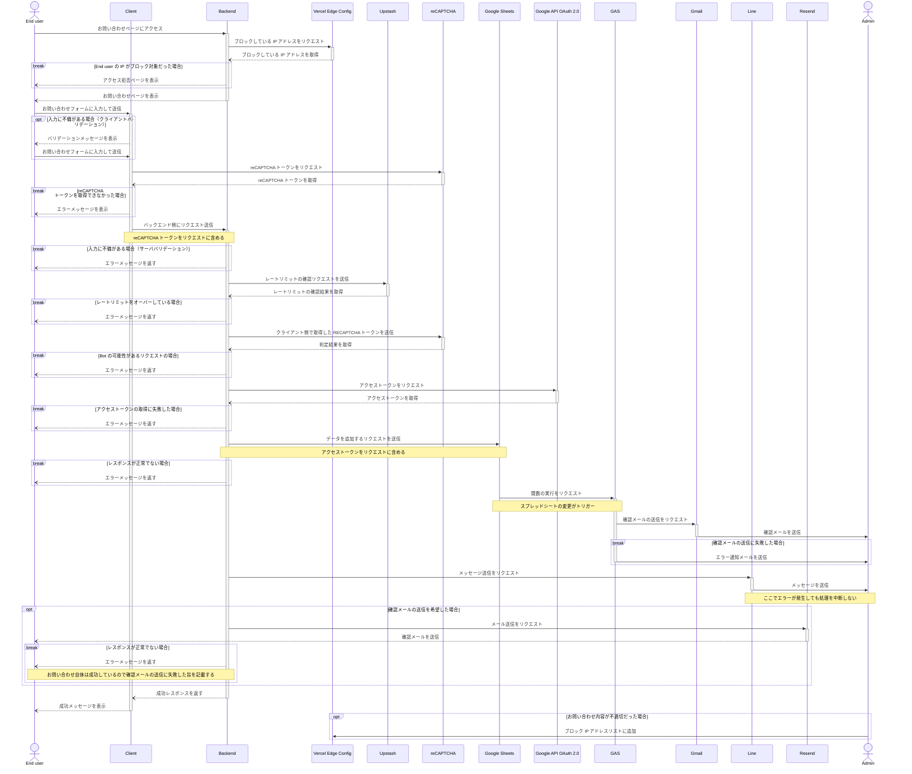
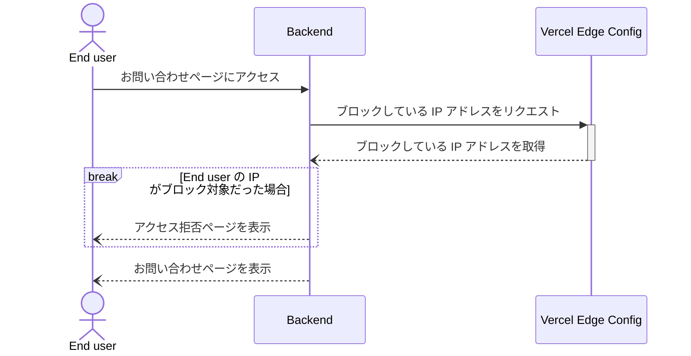
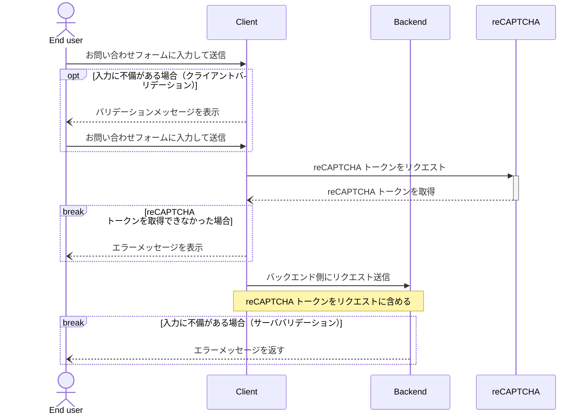
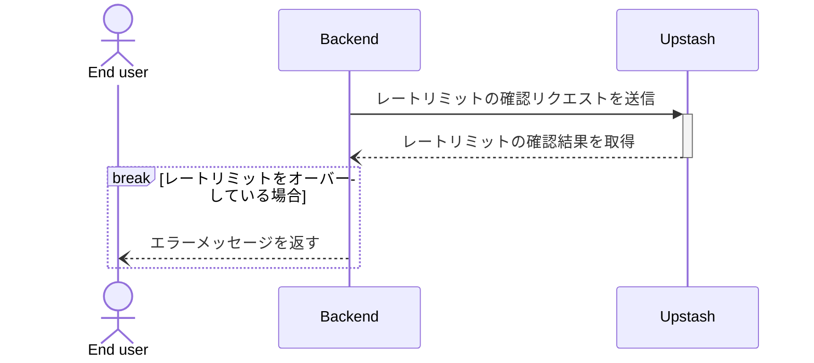
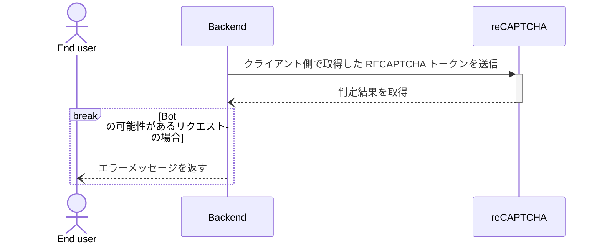
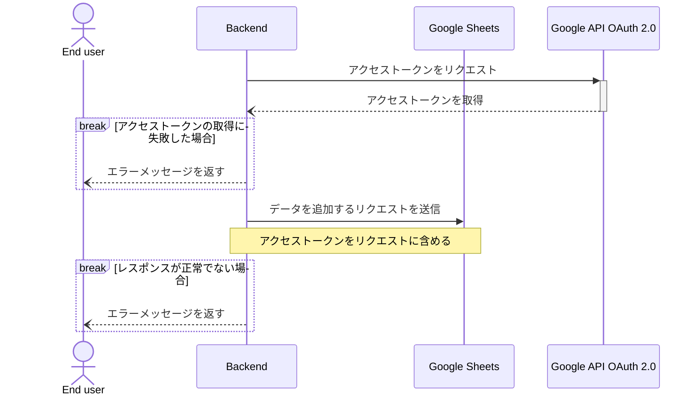
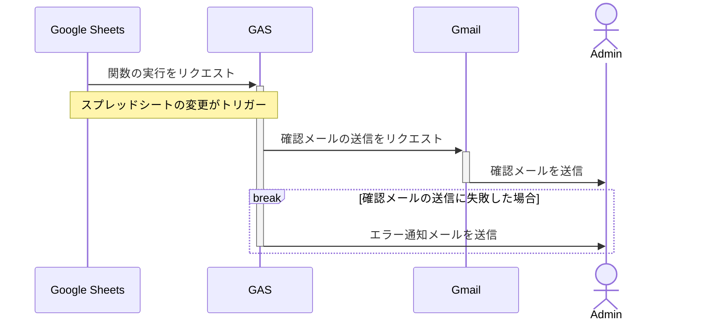
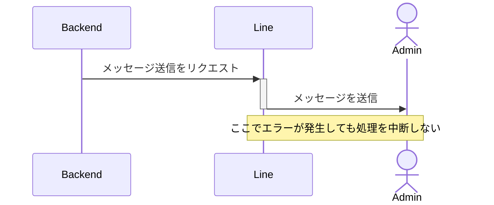
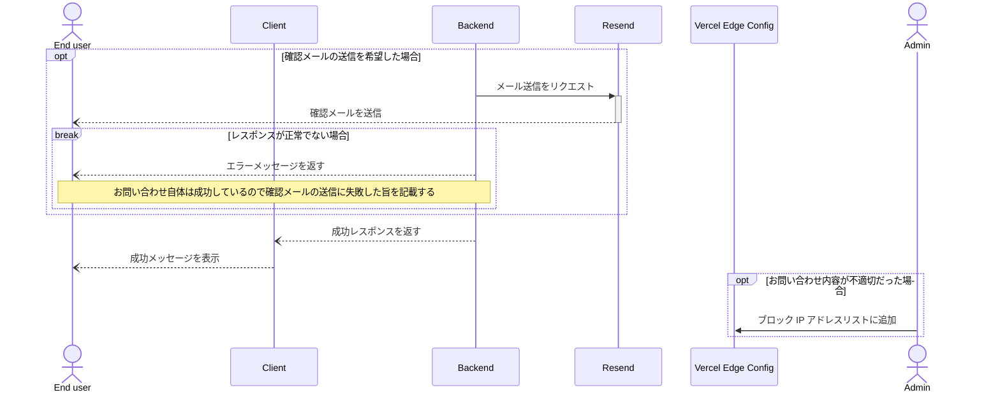

一方的にコンテンツを積み上げていく単方向的なアプローチから脱却すべく、重い腰をあげてお問い合わせ機能を実装した。
特にこだわりがないのであればリッチな UI を標準装備した Google フォームを使えば面倒な機能を実装せずに、はい終わりである。

しかし、エンジニアの個人サイトのお問い合わせフォームが Google フォームというのはちょっと寂しい。
せっかくなので自分が理想とするお問い合わせフォームを作ってみることにした。
一から実装するとなるとボット対策や自動返信メール、管理者（私）への通知をどうするかなど意外と考えることがあって面倒だったが楽しかった。

一気に実装してしまったので思い出しながら要点だけまとめていく。

## 全体の処理の流れ



上記が全体の処理をまとめたシーケンス図になるのだが、レンダリングして初めて文字の小ささに気づいた。
今のところズーム機能はないため、目を凝らして見ていただく他ない。

<Details summary='レンダリング前の Mermaid'>
  ````md
  ```mermaid
  sequenceDiagram
      actor E as End user
      participant C as Client
      participant B as Backend
      participant V as Vercel Edge Config
      participant U as Upstash
      participant RC as reCAPTCHA
      participant GS as Google Sheets
      participant GT as Google API OAuth 2.0
      participant GA as GAS
      participant GM as Gmail
      participant L as Line
      participant R as Resend
      actor A as Admin

      E ->>+ B: お問い合わせページにアクセス
      B ->>+ V: ブロックしている IP アドレスをリクエスト
      V --)- B: ブロックしている IP アドレスを取得

      break End user の IP がブロック対象だった場合
          B --) E: アクセス拒否ページを表示
      end

      B --)- E: お問い合わせページを表示

      E ->>+ C: お問い合わせフォームに入力して送信

      opt 入力に不備がある場合（クライアントバリデーション）
          C --) E: バリデーションメッセージを表示
          E ->> C: お問い合わせフォームに入力して送信
      end

      C ->>+ RC: reCAPTCHA トークンをリクエスト
      RC --)- C: reCAPTCHA トークンを取得

      break reCAPTCHA トークンを取得できなかった場合
          C --) E: エラーメッセージを表示
      end

      C ->>+ B: バックエンド側にリクエスト送信
      Note over C, B: reCAPTCHA トークンをリクエストに含める

      break 入力に不備がある場合（サーババリデーション）
          B --) E: エラーメッセージを返す
      end

      B ->>+ U: レートリミットの確認リクエストを送信
      U --)- B: レートリミットの確認結果を取得

      break レートリミットをオーバーしている場合
          B --) E: エラーメッセージを返す
      end

      B ->>+ RC: クライアント側で取得した RECAPTCHA トークンを送信
      RC --)- B: 判定結果を取得

      break Bot の可能性があるリクエストの場合
          B --) E: エラーメッセージを返す
      end

      B ->>+ GT: アクセストークンをリクエスト
      GT --)- B: アクセストークンを取得

      break アクセストークンの取得に失敗した場合
          B --) E: エラーメッセージを返す
      end

      B ->> GS: データを追加するリクエストを送信
      Note over B, GS: アクセストークンをリクエストに含める

      break レスポンスが正常でない場合
          B --) E: エラーメッセージを返す
      end

      GS ->>+ GA: 関数の実行をリクエスト
      Note over GS, GA: スプレッドシートの変更がトリガー

      GA ->>+ GM: 確認メールの送信をリクエスト
      GM ->>- A: 確認メールを送信

      break 確認メールの送信に失敗した場合
          GA ->>- A: エラー通知メールを送信
      end

      B ->>+ L: メッセージ送信をリクエスト
      L ->>- A: メッセージを送信
      Note over L, A: ここでエラーが発生しても処理を中断しない

      opt 確認メールの送信を希望した場合
          B ->>+ R: メール送信をリクエスト
          R --)- E: 確認メールを送信

          break レスポンスが正常でない場合
              B --) E: エラーメッセージを返す
              Note over E, B: お問い合わせ自体は成功しているので確認メールの送信に失敗した旨を記載する
          end
      end

      B --)- C: 成功レスポンスを返す
      C --)- E: 成功メッセージを表示

      opt お問い合わせ内容が不適切だった場合
          A ->> V: ブロック IP アドレスリストに追加
      end
  ```
  ````
</Details>

さすがにこれでは使い物にならないので各々の処理ごとにシーケンス図を書き直した。
ただ、全体の処理を分割するとライフラインの実行仕様が把握しにくくなるので一応残してある。

エラーの箇所を省いて簡単に流れを箇条書きすると以下のようになる。

1. ユーザがお問い合わせページにアクセスする
2. Vercel Edge Config からブロックしている IP アドレスリストを取得して判定する
3. お問い合わせページを表示する
4. ユーザがお問い合わせフォームに入力して送信する
5. クライアント側で reCAPTCHA トークンを取得する
6. バックエンド側に 5 を含むリクエストを送信する
7. Upstash でレートリミットを確認する
8. reCAPTCHA にリクエストの判定を依頼する
9. Google API OAuth 2.0 を利用してアクセストークンを取得する
10. Google Sheets にお問い合わせ内容を記録する
11. Google Apps Script が確認メールの送信を Gmail にリクエストする
12. Gmail から管理者へメールが送信される
13. LINE から管理者へメッセージが送信される
14. ユーザが確認メールの送信を希望する場合は Resend からメールを送信する
15. ユーザに成功メッセージを表示する
16. お問い合わせ内容が不適切だった場合は手動で Vercel Edge Config のブロック IP アドレスリストに登録する

## IP アドレス制限



あまり考えたくないが、お問い合わせフォームを使って嫌がらせが行われる可能性は万が一にもある。
そうなってからコードを書いて対応するのは面倒くさいのであらかじめ IP アドレス制限機能を追加しておく。

悪意のある IP アドレスを毎回ビルドに組み込むのでは待ち時間が長く即効性に欠けるので Vercel のグローバルデータストアである [Edge Config](https://vercel.com/docs/storage/edge-config) を利用する。

以下のように JSON 形式で記述できる。

```json
{
  "blockIps": ["127.0.0.1"]
}
```

上記で設定した値を Next.js のアクション実行前に読み取って適切なルーティングを行う。
具体的にはリクエスト完了前にコードを実行可能な [Middleware](https://nextjs.org/docs/app/building-your-application/routing/middleware) に処理を追加する。

```ts title="src/middleware.ts" showLineNumbers
import type { NextRequest } from 'next/server';
import { NextResponse } from 'next/server';
import { get } from '@vercel/edge-config';

export const config = { matcher: '/((?!api|_next|static|public|favicon).*)' };

export const middleware = async (request: NextRequest) => {
  const blockIps = await get<string[]>('blockIps');
  const accessIp = request.ip;

  if (accessIp && blockIps?.includes(accessIp)) {
    request.nextUrl.pathname = '/forbidden';
    return NextResponse.rewrite(request.nextUrl, { status: 403 });
  }
};
```

8 行目で Edge Config からブロックしている IP アドレスリストを取得して、9 行目でリクエスト時の IP アドレスを取得している。
リクエスト時の IP アドレスがブロック対象の IP アドレスリストに含まれる場合は `/forbidden` ページに飛ばす。


嫌がらせをしてくるような人にはびっくり系のブラクラを用意してあげても良いのだが、それはちょっとやりすぎなのでシンプルなページを表示するに留めた。

ちなみに Edge Config を利用してメンテナンスモードの実装も行っている（なかなか使う機会がないけど）。

## 入力値のバリデーション



フィールドには自由に入力させてあげたいのは山々だが、制限を設けておかないととんでもない使い方をされる可能性がある。
とはいえ、あくまでお問い合わせフォームなので特に複雑なバリデーションは施していない。

今回はスキーマ宣言とバリデーション定義を一度に行える [Zod](https://zod.dev) を利用した。
昔は似たようなライブラリの [Yup](https://github.com/jquense/yup) を使ったこともあるが、今はスキーマファーストなバリデーションを実装したければ Zod を選ぶ方が無難かも[^1]。

[^1]: npm trend では 2023 年 7 月ごろに Zod が Yup を抜き去っている（[参考](https://npmtrends.com/yup-vs-zod)）

定義したスキーマ（以下参照）はクライアントだけではなく tRPC でのサーバ側バリデーションやメール送信時の型定義まで幅広く使っている。

```ts title="packages/validators/src/contact.ts" showLineNumbers
import { z } from 'zod';

export const ContactSchema = z.object({
  email: z
    .string()
    .min(1, { message: 'メールアドレスを入力してください' })
    .max(255, { message: 'メールアドレスは 255 文字以内で入力してください' })
    .email({ message: 'メールアドレスの形式が正しくありません' }),
  name: z
    .string()
    .min(1, { message: '名前を入力してください' })
    .max(255, { message: '名前は 255 文字以内で入力してください' }),
  type: z.enum(['jobScouting', 'projectConsultation', 'feedback', 'collaboration', 'other'], {
    message: 'お問い合わせ種別を選択してください',
  }),
  content: z
    .string()
    .min(1, { message: 'お問い合わせ内容を入力してください' })
    .max(2000, { message: 'お問い合わせ内容は 2000 文字以内で入力してください' }),
  shouldSendReplyMail: z.boolean(),
  recaptchaToken: z.string().optional(),
});
```

Next.js を使っていることだし、プログレッシブエンハンスメントなフォームを実現できる Server Actions を使おうと思ったが、shadcn/ui が react-hook-form に依存しているため今回は見送った。
react-hook-form でも Server Actions への対応は進みつつあるようだが、もうしばらく時間がかかりそう[^2]。

[^2]: [GitHub Issue: Support Server Actions](https://github.com/react-hook-form/react-hook-form/pull/11061)

[useActionState](https://ja.react.dev/reference/react/useActionState) を使った実装に書き換えようと試みてはみたものの、思いの外複雑な実装になったため止めた。
shadcn/ui を使っていなかったらスムーズに導入できたと思うが、いかんせん便利すぎるので離れられない。

App Router がリリースされて早くも 1 年近く経過したにもかかわらず、未だにベストプラクティスとなるバリデーションの実装方法が確立されていないので毎回悩む。
納得できる実装方法が見つかれば、Server Actions を使うように修正する予定。

クライアント側のバリデーションが終わったら reCAPTCHA にトークンのリクエストを行う。
このトークンはバックエンド側で使うのでリクエストボディに含めておく。

reCAPTCHA トークンの取得には [react-google-recaptcha-v3](https://github.com/t49tran/react-google-recaptcha-v3) を利用している。

## レートリミット



このお問い合わせフォームは複数の外部 API を無料枠の範囲で使っているため、大量のリクエストが送信されるとすぐに無料枠をオーバーしてしまう。
それは避けたいので [Upstash](https://upstash.com) の Redis を使ってレートリミットを実装した。

IP アドレスをキーとして 1 分間に 1 回までフォームの送信を可能にしてある。

使用方法をイメージしやすいように 1 つのファイルにまとめてみた。

```ts showLineNumbers
import { Ratelimit } from '@upstash/ratelimit';
import { Redis } from '@upstash/redis';

type SlidingWindowProps = Parameters<typeof Ratelimit.slidingWindow>;

const rateLimiter = (tokens: SlidingWindowProps[0], windowValue: SlidingWindowProps[1]) =>
  new Ratelimit({
    redis: Redis.fromEnv(),
    limiter: Ratelimit.slidingWindow(tokens, windowValue),
  });

const getIpHash = async (ip: string) => {
  const buffer = await crypto.subtle.digest('SHA-256', new TextEncoder().encode(ip));
  return Array.from(new Uint8Array(buffer))
    .map((b) => b.toString(16).padStart(2, '0'))
    .join('');
};

export const contactRouter = {
  send: publicProcedure.input(ContactSchema).mutation(async ({ input, ctx }) => {
    if (!ctx.ip) {
      throw new TRPCError({ code: 'BAD_REQUEST' });
    }

    const ip = ctx.ip;
    const ipHash = await getIpHash(ip);
    const { success } = await rateLimiter(1, '1 m').limit(ipHash);

    if (!success) {
      throw new TRPCError({ code: 'TOO_MANY_REQUESTS' });
    }

    // ...
  }),
};
```

Upstash には `@upstash/ratelimit` という便利なライブラリがあるのでシンプルに実装が可能。
他の API でも利用しやすいように関数 `rateLimiter` として汎用化している。
また、念の為 IP アドレスは SHA-256 でハッシュ化してから Redis に保存している。

お問い合わせフォームを送信してから 1 分以内に再度お問い合わせを送信すると「お問い合わせの送信回数が上限に達しました。しばらくしてから再度お試しください。」とエラーが表示される。

## Bot からの保護



機械的に POST できる窓口を設けている以上、ボット対策を考えなければならない。
レートリミットを設定しているとはいっても 1 分ごとに送信するみたいな設定をされたら 1 時間に 60 回リクエストを投げられてしまう（そう考えるとレートリミットのコードを公開しているのは悪手だ）。
さすがに何の利益もないのでそのようなことはあるはずもないのだが心配性なので念には念を入れておく。

Bot 対策として Google の [reCAPTCHA Enterprise](https://cloud.google.com/recaptcha-enterprise?hl=ja) を導入した。
先ほどクライアント側の処理で reCAPTCHA トークンを取得していたが、それをサーバ側で利用する。

サーバ側から reCAPTCHA にリクエストを投げると 0.0 ~ 1.0 の判定結果が返ってくる[^3]。
値が低くなるほどボットの可能性があるリクエストということになる。
ひとまずスコアが 0.7 未満であればエラーメッセージを返すようにしている。

[^3]: デフォルトで使用できるスコアレベルは、0.1、0.3、0.7、0.9 の 4 つのみ（[ソース](https://cloud.google.com/recaptcha-enterprise/docs/interpret-assessment-website?hl=ja)）。
全てのスコアを使いたければ Google のセールスチームに連絡が必要。面倒なのでしていない

当初はスコアを取得するために Google から提供されている [@google-cloud/recaptcha-enterprise](https://github.com/googleapis/google-cloud-node/tree/main/packages/google-cloud-recaptchaenterprise) を利用しようとした。

前提として当サイトの tRPC 経由の API 作成には Next.js の Edge Runtime を使っている。
Edge Runtime はパフォーマンスに優れているが Node.js API を全てサポートしていない[^4]。
そのため、パッケージ内部において Edge Runtime でサポートされていない API を利用しているとエラーが発生してしまう。

[^4]: [Edge Runtime でサポートされている API](https://nextjs.org/docs/app/api-reference/edge)

今回は不幸にもそのエラーに当たってしまった。
そうなった場合は Web 標準の [fetch API](https://developer.mozilla.org/ja/docs/Web/API/Fetch_API) を使って処理を自分で書く必要がある。
あくまでも SDK は REST API のラッパーに過ぎないため記述量は多くなるが何とかなる。
以下がその処理。

```ts title="packages/api/src/services/google/recaptcha.ts" showLineNumbers
export const verifyRecaptcha = async ({
  recaptchaToken,
  expectedAction,
}: {
  recaptchaToken: string;
  expectedAction: string;
}) => {
  const request = {
    event: {
      token: recaptchaToken,
      expectedAction,
      siteKey: env.RECAPTCHA_SITE_KEY,
    },
  } satisfies RecaptchaRequest;

  const response = await fetch(
    `https://recaptchaenterprise.googleapis.com/v1/projects/${env.GCP_PROJECT_ID}/assessments?key=${env.RECAPTCHA_SECRET_KEY}`,
    {
      method: 'POST',
      headers: {
        'Content-Type': 'application/json',
      },
      body: JSON.stringify(request),
    },
  );

  if (!response.ok) {
    throw new Error('Failed to verify recaptcha');
  }

  return (await response.json()) as RecaptchaResponse;
}
````

これでスコアを取得できる。

## Google Sheets にお問い合わせ内容を記録



ユーザから送信されたお問い合わせ内容は Google Sheets（スプレッドシート）に保存する。
RDBMS に保存しても良かったが、確認用の API と UI を作成しなければならず面倒だ。

Google Sheets であればソートや絞り込みができたり、後述する GAS（Google Apps Script）と連携できるので色々とデータ活用の幅が広がる。

Node.js からお手軽に API を扱える [google-api-nodejs-client](https://github.com/googleapis/google-api-nodejs-client) を使って一旦実装してみたが、reCAPTCHA と同様に Edge Runtime に起因するエラーが発生した。
面倒だが直接 REST API を叩く実装に書き換えた。

はまりどころとして Google Sheets にアクセスするためには [JWT トークン](https://jwt.io/)が必要になる。
このトークンは、サービスアカウントの秘密鍵で署名する必要があったので Edge Runtime でも使用可能な [jose](https://github.com/panva/jose) を使って生成した。

```ts title="packages/api/src/services/google/token.ts" showLineNumbers
import { importPKCS8, SignJWT } from 'jose';

import { env } from '../../../env';

interface Token {
  access_token: string;
  expires_in: number;
  token_type: string;
}

type TokenWithExpiration = Token & {
  expires_at: number;
};

const payload = {
  iss: env.GCP_CLIENT_EMAIL,
  scope: 'https://www.googleapis.com/auth/spreadsheets',
  aud: 'https://www.googleapis.com/oauth2/v4/token',
  exp: Math.floor(Date.now() / 1000) + 60 * 60,
  iat: Math.floor(Date.now() / 1000),
};

const createToken = async () => {
  const privateKey = await importPKCS8(env.GCP_PRIVATE_KEY, 'RS256');

  const token = await new SignJWT(payload)
    .setProtectedHeader({ alg: 'RS256' })
    .setIssuedAt()
    .setIssuer(env.GCP_CLIENT_EMAIL)
    .setAudience('https://www.googleapis.com/oauth2/v4/token')
    .setExpirationTime('1h')
    .sign(privateKey);

  const form = {
    grant_type: 'urn:ietf:params:oauth:grant-type:jwt-bearer',
    assertion: token,
  };

  const tokenResponse = await fetch('https://www.googleapis.com/oauth2/v4/token', {
    method: 'POST',
    body: JSON.stringify(form),
    headers: { 'Content-Type': 'application/json' },
  });

  if (!tokenResponse.ok) {
    throw new Error('Failed to get token');
  }

  const json = (await tokenResponse.json()) as Token;

  return {
    ...json,
    expires_at: Math.floor(Date.now() / 1000) + json.expires_in,
  };
};

let token: Promise<TokenWithExpiration> | null = null;

export const authenticate = async () => {
  if (token === null) {
    token = createToken();
  }

  let resolvedToken = await token;

  if (resolvedToken.expires_at < Math.floor(Date.now() / 1000)) {
    token = createToken();
    resolvedToken = await token;
  }

  return resolvedToken;
};
```

これで API に必要な認証用トークンを取得できた。
次に Google Sheets に追加するための処理を書いていく。

```ts title="packages/api/src/services/google/sheets.ts" showLineNumbers
import { env } from '../../../env';
import { GoogleSheetsError } from '../../exceptions';
import { authenticate } from './token';

export const appendGoogleSheets = async ({ sheetName, values }: { sheetName: string; values: string[][] }) => {
  const { access_token } = await authenticate();

  const params = {
    range: `${sheetName}!A2`,
    insertDataOption: 'INSERT_ROWS',
    valueInputOption: 'USER_ENTERED',
    resource: {
      values,
    },
  };

  const response = await fetch(
    `https://sheets.googleapis.com/v4/spreadsheets/${env.GOOGLE_SHEETS_ID}/values/${encodeURIComponent(params.range)}:append?valueInputOption=${params.valueInputOption}&insertDataOption=${params.insertDataOption}`,
    {
      method: 'POST',
      headers: {
        Authorization: `Bearer ${access_token}`,
        Accept: 'application/json',
        'Content-Type': 'application/json',
      },
      body: JSON.stringify(params.resource),
    },
  );

  if (!response.ok) {
    throw new GoogleSheetsError('Google Sheets API request failed: ' + response.statusText);
  }

  console.log('Append to Google Sheets was successful');
};
```

Google Sheets の 1 行目にはカラム名を設定するため 2 行目から下に追加していく。
本当は降順になるようにしたかったが、そのようなオプションはなかった。
毎回全ての行を取得して降順に成形してから API を投げるのはデータが多くなってきたときの処理が重そうなので止めた。

## Gmail で確認メールを管理者に送信



後述する LINE にも通知メッセージを送信するようにしているが、仮に LINE API が機能しなかった場合、お問い合わせが来ていることに気づかずビッグチャンスを逃す可能性がある。
そうならないためにも Google Sheets にデータが登録されたタイミングで管理者（私）にお問い合わせ内容が記載されたメールを送信されるようにした。

実装方法としては GAS を使用する。
GAS にはブラウザで記述可能なエディタが付属しているけど TypeScript が使えなかったり、モジュール化できなかったりと使いずらい。
なので Vite でトランスパイルしてから [clasp](https://github.com/google/clasp) を使って GAS にデプロイする方法をとることにした。

`@google/clasp` をインストールすれば型補完が効いて書き心地が良いので必ず入れておきたい。
実装内容は以下のとおりでシンプルにまとめてある。

```ts title="packages/google-apps-script/src/services/contact.ts" showLineNumbers
import type { z } from 'zod';

import type { ContactSchema } from '@kkhys/validators';

type SendEmailParameters = Parameters<typeof GmailApp.sendEmail>;
type ContactSchemaProps = z.infer<typeof ContactSchema>;

const sheet = SpreadsheetApp.openById(import.meta.env.VITE_GOOGLE_SHEETS_ID).getActiveSheet();
const lastRow = sheet.getLastRow();

const emailColumn = 1;
const nameColumn = 2;
const typeColumn = 3;
const contentColumn = 4;

export const sendContactEmail = () => {
  const recipient = 'simplelogin.alibi716@aleeas.com' satisfies SendEmailParameters[0];
  const subject = 'お問い合わせがありました' satisfies SendEmailParameters[1];
  const body = generateBody() satisfies SendEmailParameters[2];
  const options = {
    // from: 'noreply@kkhys.me',
    name: 'Keisuke Hayashi',
    // htmlBody: html,
  } satisfies SendEmailParameters[3];

  const lock = LockService.getScriptLock();
  if (lock.tryLock(1000)) {
    GmailApp.sendEmail(recipient, subject, body, options);
    lock.releaseLock();
  }
};

const generateBody = () => {
  const email = sheet.getRange(lastRow, emailColumn).getValue() as ContactSchemaProps['email'];
  const name = sheet.getRange(lastRow, nameColumn).getValue() as ContactSchemaProps['name'];
  const type = sheet.getRange(lastRow, typeColumn).getValue() as ContactSchemaProps['type'];
  const content = sheet.getRange(lastRow, contentColumn).getValue() as ContactSchemaProps['content'];

  return `kkhys.me にお問い合わせがありました。

# 名前
${name}

# メールアドレス
${email}

# お問い合わせ種別
${type}

# お問い合わせ内容
${content}
`;
};
```

Google Sheets と GAS を連携される際の注意点として、変更をトリガーに処理を行いたい場合は `LockService.getScriptLock` を使って排他制御を行う必要がある。
でないと、データが追加されたときに複数回トリガーが発火する可能性がある。

デプロイ後は GAS 側でトリガーを設定する。
仮に GAS の実行に失敗した場合でもエラー通知を送信できるので、不具合に気づかず日々過ごしていくという心配はない。


## LINE で確認メッセージを管理者に送信



残念ながらメールをすぐに確認する習慣は今までの人生で身に付かなかった。
最も早く反応できるサービスを考えると LINE 一択である。
そのため、お問い合わせがあった場合は LINE に通知メッセージを送信する。

Gmail はサブで LINE をメインとして運用していく。

LINE にも [line-bot-sdk-nodejs](https://github.com/line/line-bot-sdk-nodejs) という便利なライブラリがあるが、ご多分に漏れず Edge Runtime では使えなかった。
そのため、今までと同様に fetch API を使って実装した。

```ts title="packages/api/src/services/line.ts" showLineNumbers
export const sendLineMessage = async ({ message }: { message: string }) => {
  const response = await fetch('https://api.line.me/v2/bot/message/push', {
    method: 'POST',
    headers: {
      'Content-Type': 'application/json',
      Authorization: `Bearer ${env.LINE_CHANNEL_ACCESS_TOKEN}`,
    },
    body: JSON.stringify({
      to: env.LINE_USER_ID,
      messages: [
        {
          type: 'text',
          text: message,
        },
      ],
    }),
  });

  if (!response.ok) {
    throw new LineError('Failed to send a message to LINE');
  }

  console.log('Successfully sent a message to LINE');
};
```

お問い合わせ用のお一人様チャネルを作成してそこにメッセージを送信している。
仮に送信に失敗しても Gmail は送信されているため、catch ブロックでエラーを捕捉してエラーログを出力するに留めている。

## Resend で確認メールをユーザに送信



お問い合わせしたユーザが入力内容確認メールの返信を希望する場合は [Resend](https://resend.com) を使ってメールを送信している。
自動返信メールはスパムに利用される可能性もあるため、導入するか迷ったが、ユーザの利便性を考えてオプトインできるようにした。

大抵の場合、お問い合わせフォームを悪用したスパムは bot から行われるので reCAPTCHA を実装しておけば大丈夫だろうと思っている。
人力で送信されたら IP アドレスでブロックする。
今回は実装していないが、海外からの不正なリクエストがあればお問い合わせ可能な地域を日本だけにするとか色々と考えないといけないことが多くて面白い。

閑話休題。
Resend は幸いにも Edge Runtime にも対応していたため非常に楽に実装できた。

```ts title="packages/api/src/services/email.ts" showLineNumbers
import { Resend } from 'resend';

const resend = new Resend(env.RESEND_API_KEY);
const administrator = {
  name: 'Keisuke Hayashi',
  email: 'noreply@kkhys.me',
};

export const sendEmail = async ({
  to,
  subject,
  body: { html, text },
  tags,
}: {
  to: string;
  subject: string;
  body: Record<'html' | 'text', string>;
  tags?: { name: string; value: string }[];
}) => {
  const { data, error } = await resend.emails.send({
    from: `${administrator.name} <${administrator.email}>`,
    to,
    subject,
    html,
    text,
    tags,
    headers: {
      'X-Entity-Ref-ID': new Date().getTime().toString(),
    },
  });

  if (error) {
    throw new EmailError(`Failed to send email to ${to}. Error: ${JSON.stringify(error)}`);
  }

  console.log(`Successfully sent email to ${to}. Response: ${JSON.stringify(data)}`);
};
```

メールヘッダに `X-Entity-Ref-ID` を付与しているのは Gmail のスレッド化を防ぐためである。
お問い合わせフォームなら何度も送ることはないと思うのでなくても問題ないが。

メール本文には HTML とプレーンテキストの両方を設定している（[マルチパートメール](https://sendgrid.kke.co.jp/blog/?p=8262)）。
これらを作成するのは面倒だが、[react-email](https://react.email) というライブラリを使うことで TSX と Tailwind CSS を使いつつ楽に実装できた。
1 つのソースから HTML とプレーンテキストの両方を出力可能なのは素晴らしい。
開発サーバを立ち上げてプレビューもできる。


そもそもユーザにも Gmail を使ってメールを送信すれば良いじゃないという意見もあると思う。
しかし、Resend の管理画面の使いやすさやトラッキングできる点を考えると外部に送信するメールであれば Resend を使っていく方がベターだ。

最後にクライアントからユーザに成功メッセージを返せば一連の流れは完了する。
仮に自動返信メールの送信に失敗した場合は、「お問い合わせは成功したが、メールの送信には失敗した」旨を伝えるエラーメッセージを表示する。
ここでお問い合わせ自体が失敗したとエラーメッセージを表示させたらユーザが何度も送信しないといけない羽目になるので注意。

もし、不適切なお問い合わせがあった場合は IP アドレスを Google Sheets に保存しているため、それを Edge Config に登録する。
そうすれば、このサイトにリクエストがあった段階で弾ける。

## さいごに

気軽に実装する機能にしては重かったが、色々な API を使うのは楽しい。
