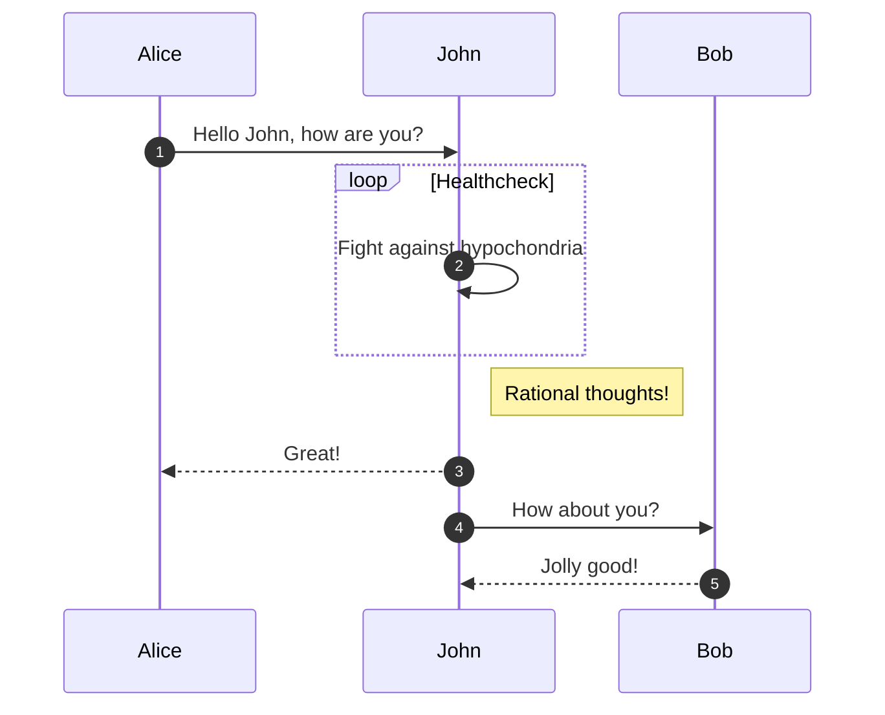

When you change a source file, Contentlayer automatically updates the content cache, which prompts Next.js to reload the content on screen.

# Heading 1

## Heading 2

### Heading 3

#### Heading 4

---

- test
- test2
- test3

1. test1
2. test2
3. test3

# GFM

## Autolink literals

www.example.com, https://example.com, and contact@example.com.

## Footnote

A note[^1]

[^1]: Big note.

## Strikethrough

~one~ or ~~two~~ tildes.

## Table

| a   | b   |   c |  d  |
| --- | :-- | --: | :-: |

## Tasklist

- [ ] to do
- [x] done

Thumbs up: :+1:, thumbs down: :-1:.

Families: :family_man_man_boy_boy:

Some flags: :wales:, :scotland:, :england:.

Lift($L$) can be determined by Lift Coefficient ($C_L$) like the following
equation.

$$
L = \frac{1}{2} \rho v^2 S C_L
$$

```typescript {1} title="title" caption="caption"
const rehypePrettyCodeOptions: Partial<Options> = {
  theme: 'one-dark-pro',
  tokensMap: {
    // VScode command palette: Inspect Editor Tokens and Scopes
    // https://github.com/Binaryify/OneDark-Pro/blob/47c66a2f2d3e5c85490e1aaad96f5fab3293b091/themes/OneDark-Pro.json
    fn: 'entity.name.function',
    objKey: 'meta.object-literal.key',
  },
  onVisitLine(node) {
    // Prevent lines from collapsing in `display: grid` mode, and
    // allow empty lines to be copy/pasted
    if (node.children.length === 0) {
      node.children = [{ type: 'text', value: ' ' }];
    }
    node.properties.className = [''];
  },
  onVisitHighlightedLine(node) {
    node.properties.className.push(
      '!border-l-rose-300/70 bg-rose-200/10 before:!text-white/70',
    );
  },
};
```

This is an array `[1, 2, 3]{:js}` of numbers 1 through 3.

The name of the function is `getStringLength{:.fn}`.


