二月某日、私は南半球の地にいた。
それはインドネシアのバリ島のことだが、地図を見て初めて南半球であることを知った。
地理的にはジャワ島とロンボク島の間にある。プログラマであれば、[Java](https://ja.wikipedia.org/wiki/Java) と [Lombok](https://projectlombok.org) と聞いて嗚呼となるはずだ。

なぜ、バリ島に行くことになったのか。それは私もよくわからない。成り行きで行くことになってしまった。しかも四泊六日。
しかし、結果として出会った人々やエスニックな料理、多種多様な風景が刺激的で行ってみて良かったと思っている。

本当であれば記憶が新鮮なうちに書き留めておきたかったのだが、仕事が忙しすぎて書く暇がなかった。
そのため撮り溜めた写真を見返しながら、あのときに感じたことを思い出して書いていく。

## 意外に面倒な事前準備

当然だが国内旅行のように航空券とホテルだけ予約すれば大丈夫というわけではない。
海外の場合は様々な手続きが必要になる。**バリ島の場合は観光地ということもあってか意外とビザ等の準備が面倒だった。**
ここではわざわざ書かないが、バリ島のことについて親切にも解説してあるサイトや YouTube はたくさんあるのでそちらを見ていただきたい。

書類関係の準備はレールに乗っていけば何も考えずに終わる。今回悩んだのが何を着るかということだった。
日本は平均気温が一番低い時期だがバリ島は天気予報を見ると 30℃ を超えており、おそらく半袖でないと汗だくで不快な旅になってしまう。

結果として、**コートは空港の預かりサービスに預けて、現地の空港で半袖に着替えるのがベストアンサーであった。**
肌寒いこともあるだろうなあと思ってパーカーを持っていったが荷物になっただけだった。
ただ、飛行機の中はけっこうな寒さだったため長袖は一枚は必要になる。

## あっという間にングラ・ライ国際空港に到着

日本から直行便でバリ島に行く場合はングラ・ライ国際空港一択だと思う。
驚いたのだが、**到着ビザ（VOA）をオンラインで済ませておいたため、特に入国審査を受けることなく誰も並んでいない無人のゲートで顔写真の照合をするだけで入国できた。**

それから、成田空港で航空券を発行してもらうときにバリ島では観光税が最近導入されたということを知ったため忘れずに支払った。
**観光地では支払った際にもらった QR コードの提示を求められる可能性があるとのことだったが、結局一度もそのようなケースはなかった。**

到着した時間は陽が落ちた頃だったため、慣れない地でそこからタクシーを探してというのはさすがに面倒くさい。早くホテルに行って休みたい。
なので [KKday](https://www.kkday.com/ja) で送迎を依頼しておいた。
しかし、そこからが大変だった。名前を書いたボードを持って待っていてくれると連絡があったが、同じようにボードを持った人が 30 人ぐらいいた。

2 往復しても見つけられずにおかしいと思って予約履歴を見ると氏名を漢字で入力していた。
さっき見た限りでは漢字のボードはなかった。もしやと思って再度探してみると思ったとおり、翻訳したであろう私の氏名らしきボードを見つけた。

中国や韓国にも存在する苗字なのでもはや日本語の原型は残っておらずかなり紛らわしかった。自分でもよく分かったなと思う。危うく別のタクシーで行くところだった（必ず、氏名は英語で入力しましょう）。

## ヴィラでのんびり

空港周辺の渋滞が酷く、宿泊予定地のヌサドゥアまで時間がかかりそうだったので別料金で高速道路を利用した。
後からドライバーに聞いた話だが 2022 年の G20 サミットがあるため整備されたらしい。
地元の人はあまり利用しないらしくさっきまでの混雑が嘘のようにスイスイ進んで行った。

**ヌサドゥア周辺はホテルが密集している地域で飲食店などはほとんど見当たらなかった。**

今回は [Amarterra Villas Resort Bali Nusa Dua](https://www.marriott.com/en-us/hotels/dpsav-amarterra-villas-resort-bali-nusa-dua-autograph-collection/overview/) というヴィラに宿泊した。
専用のプール付きでリゾート感満載だ。雨が降っていたが早速プールで泳いでみたりした。さすがに寒くなっていきなり風邪を引きそうになった。

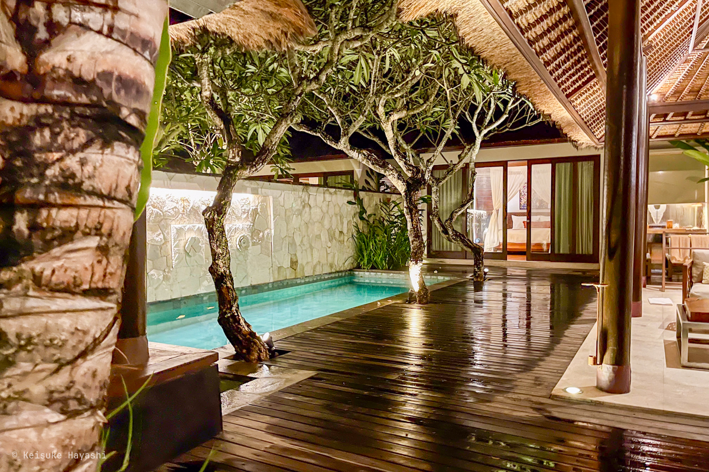

疲れていたし、タクシーでどこか行くにしても時間がかかるのでホテル内にある Terra Terrace というレストランで済ませた。
日本人でも違和感なく食べられる味で普通に美味しかった。店員におすすめを聞いてからオーダーした、**スパイスが大量にかけられた仔牛の肉**が特に良かった。なんて名前だったかな。

食事を楽しんでいると突然店内にバリの民族衣装をまとったダンサーが入ってきて一緒に踊らないかと言われた。
恥ずかしかったので私は踊らなかったが、中には訳もわからず踊っている人がいて、そっちの方が見ていて面白かった。

## レンボンガン島で地獄のシュノーケリング

次の日、ゆっくり寝ていたかったが、シュノーケリングのツアーに申し込んでいたためゆっくりする暇もなく Grab[^1] でタクシーを呼んで Sanur Beach Harbour に向かった。
ツアーは [Klook（クルック）](https://www.klook.com/ja) というサイトで予約した。
3 か所のシュノーケリングスポットを周るツアーで、 1 人あたり 6,000 円ほどだった。

[^1]: 東南アジアでは一般的な配車サービス。Go と同じレイヤー

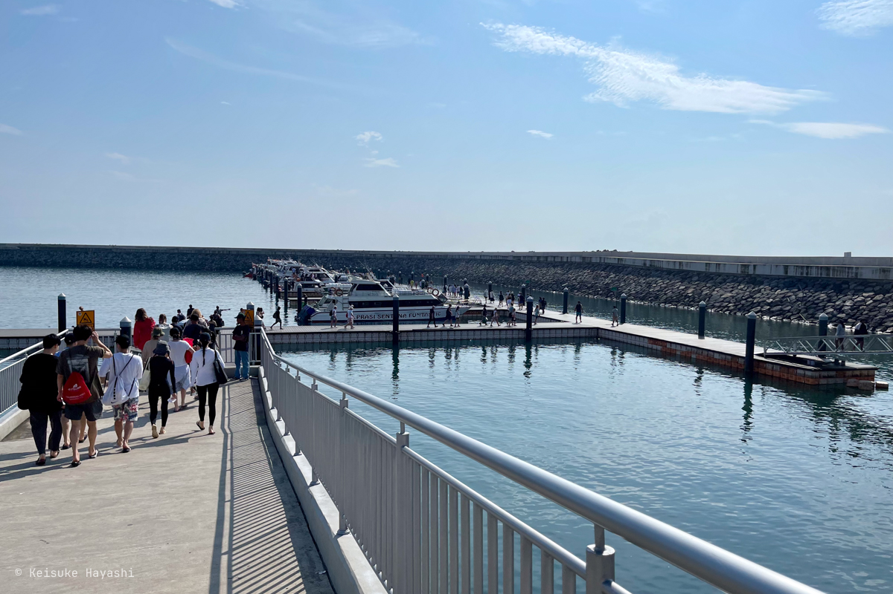

ここまで気候のことは書いていなかったが、気温は 30℃ を超えて湿度が高く蒸し暑い（日本は 10℃ を下回っているというのに）。
それに加えて人の熱気で息苦しい船の中で寝ているといつの間にかレンボンガン島に到着した。

そこからシュノーケリングスポットへ連れて行ってくれる船がある場所まで、軽トラを改造したような車の荷台に乗って悪路を進んでいった。
お尻が浮くぐらいボコボコな道だったり、顔を出したら首が撥ねられるぐらいスレスレを車がすれ違ったりとスリリングだった。

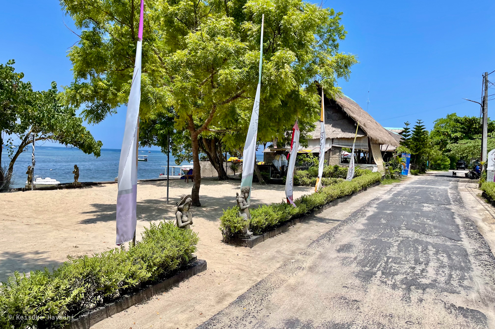

シュノーケリングスポットは主に三箇所あり、まずはマンタが現れるという Manta Bay に行った。
天候は良い割に地理的な要因なのか波がけっこう高く、船はすごく揺れていた。

Manta Bay に着くと早速海に飛び込んだ。というよりか飛び込まされた。
波が高いのと潮の流れが早かったのでなかなか怖かった。**経験が全く無い人であれば死を覚悟するレベルかもしれない。**
やはりこれだけ海が荒れているとマンタはどこかに行ってしまったらしく、残念ながら見ることはできなかった。

船に戻ると突然吐き気が込み上げてきた。まだツアーは始まったばかりだというのに船酔いになってしまった。
車酔いとは違い、船酔いは途中で乗り物を降りられないのは精神的にも辛い。ずっと、ホテルに帰ってベッドで横になることだけを考えていた。

とはいえ、せっかくここまで来たのだからということで次のスポットでも海に飛び込んだ。が、そこが限界だった。
最後のスポットが一番綺麗な場所だったため酔い止めを忘れたことが悔やまれる。
こんなにハードだとは思ってもみなかった。内臓を強くしたいなあ。

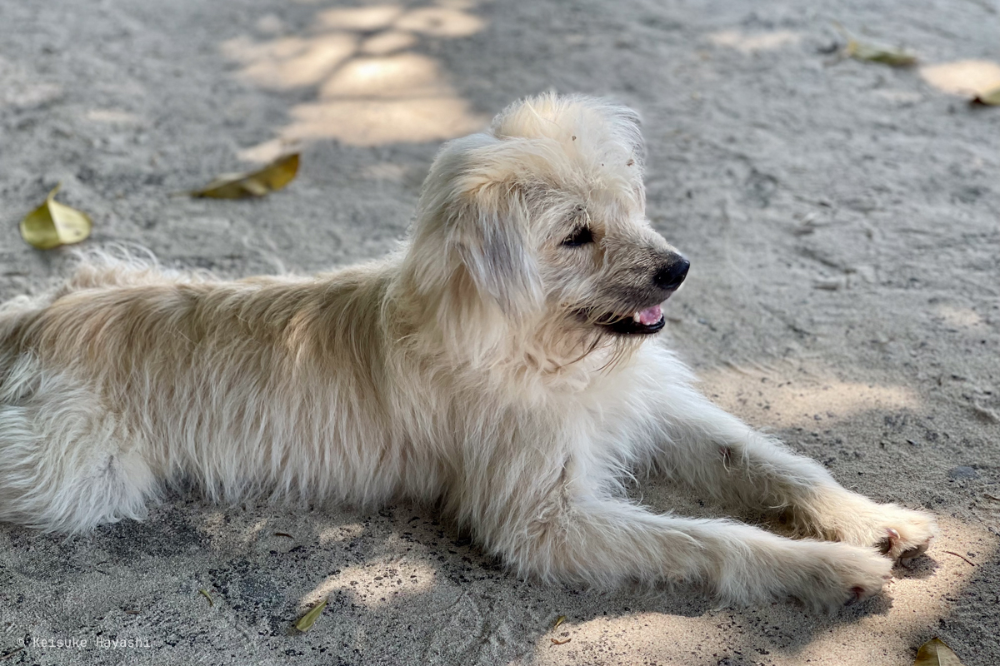

バリ島に戻るまでに多少時間があったため、近くにあった Sanghyang Bay というカフェで水分補給をした。
ちなみに画像からも分かる通り、雲行きが怪しくなっている。バリ島に帰り着くと同時にスコールが降り出して大変だった。
基本的にみんな傘を持っておらず、ずぶ濡れになっていた。折り畳み傘を持ち歩くのは日本人ぐらいなのかなと錯覚するぐらいだった。

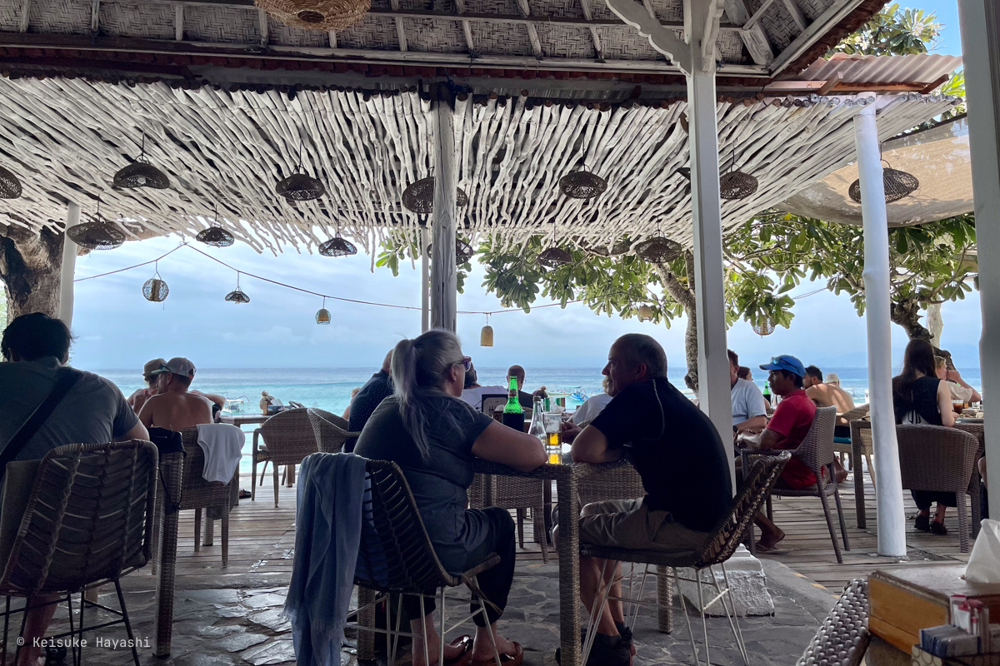

## コピルアク 100% のコーヒー

次の日はウブドに宿泊するため朝からそちらの方面で観光することにした。
**ウブド周辺は Grab が使えない**らしく[^2]どうやって観光地を巡るか日本に居るときに悩んでいた。

[^2]: 運転手の話では高額な罰金が課せられるそうだ。厳密にはウブドまでタクシーで来ることはできるがタクシーを拾えない

結局、カーチャーターを利用することにしたのだが、これが正解だった。
最初は一日中運転手（しかもガイド付き）を雇うのだから高額だと思い込んでいたが、**8 時間で 6,000 円と思ったより全然安かった。**
日本だとレンタカーを借りるだけでそれぐらいする。

しかも、そのガイドの人（以降は A 氏とする）はインドネシア人だが日本語が堪能で、実は元 JTB の社員として日本で働いていたそうだ。
バリ島の歴史や文化について詳しく説明してもらえて、かなり充実した旅行になった。
人柄も気に入ったので次の日もガイドをお願いしたいぐらいだったが、残念ながら彼に予定が入っていてダメだった。
代わりに A 氏の親戚に次の日以降の運転とガイドをお願いすることにした。

さて、まずどこに行くかというのも特に決めていなかったので A 氏と相談しながら行き先を決めることにした。
全く調べていなかったというわけではなく、日本ではるるぶを一通り読んでおり、いくつか行きたいところの目星はつけていた。

私はコーヒーが好きなのでウブドのコーヒー農園に行って、ライステラスを眺めながら優雅に飲もうかなと考えていた。
そのことを A 氏に伝えると、せっかくバリに来たのだからコピ・ルアク（Kopi Luwak）[^3]を飲んでいった方が良い、良いお店を知っているよということだった。

[^3]: ジャコウネコの糞から採られる未消化のコーヒー豆のこと。その希少性から最高級のコーヒーとして有名

※ **ガイドはキックバックを受け取るために特定の店に連れて行くことがあるらしい。**
納得できるならそれで良いが、それが不満なら全て自分で店を指定する方が良いかもしれない。

正直なところ、風景はそこまで期待していなかったし、花より団子な性格なので二つ返事でお願いすることにした。
しばらくするとビーチリゾートで有名なクタからほど近い場所にある [Triyama coffee](https://maps.app.goo.gl/cohBq4FMdQyE13Nj7) に到着した。

A 氏が先に店に入るとしばらくしてオーナーらしき人が出てきた。この人も昔は日本に住んでいたらしく日本語が堪能で、コーヒーについて詳しく教えてもらった。

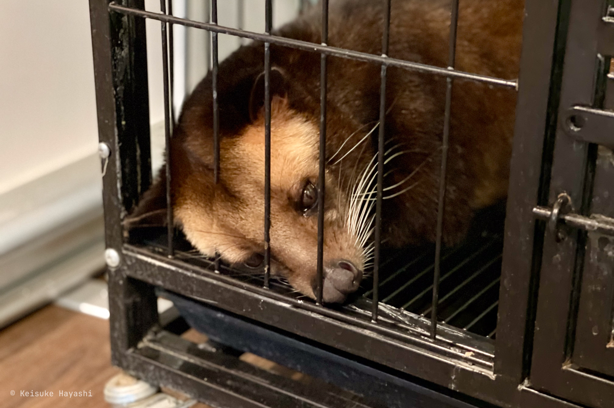

部屋の片隅にタヌキみたいな生き物がいるなと思っていたら、これがジャコウネコだった。全然猫らしくなくて面白かった。
夜行性らしく、夜になると暴れるらしい。さすがに一時的な観賞用だと思うが、ずっと檻の中にいるのはちょっとかわいそうだ。

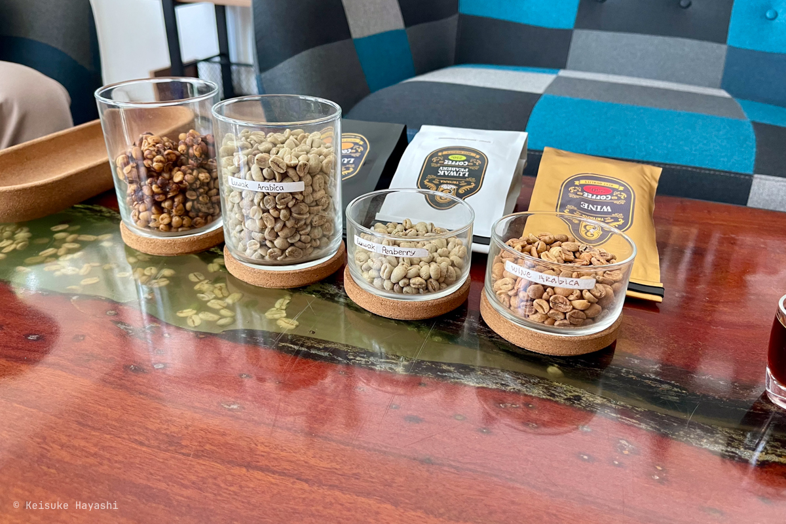

それからなぜか別室に通してもらってコーヒー豆の説明を受けた。最初は大丈夫か？と思ったがそれは杞憂であった。
覚えている限りでは以下のような話だった。

- 一般的なコピ・ルアクは他の豆とブレンドしているため、実際はほとんど入っていない
  - **バリ島の農園であっても大抵はブレンドらしい**
  - 偽物や混ざり物がほとんどのため信頼できるところを探すべき
- ここでは 100% コピ・ルアクを提供している
  - 政府発行？の証明書を見せてもらったりした（写真は撮り忘れた）
- ジャワ島に農場がある（と言っていた気がする）
- **ジャコウネコのメスよりもオスの糞で作られたコピ・ルアクの方が圧倒的に希少**
- コピ・ルアクは通常のコーヒーに比べてカフェインが少ない
- ここでは特殊な発酵方法を使ったワインコーヒーもおすすめ
- ロブスタ種ではなくアラビカ種を使っている
  - （コーヒーは個人的に酸味のあるアラビカ種の方が好き）

話しているとメスのジャコウネコから作られたコピ・ルアクとワインコーヒーが運ばれてきたので試飲させてもらった。
コピ・ルアクは一口飲んだときから爽やかさというか、飲みやすさが今まで飲んだコーヒーとは一線を画していた。
ワインコーヒーも独特なフルーティさを感じさせてかなり好きな部類に入るコーヒーであった。

オス版のコピ・ルアクは高級すぎるため試飲の提供はしていないそうだ。
しかし、せっかく信頼できるところに来たのだし、これから純正のコピ・ルアクを飲める保証もないので思い切って注文した。
**1 杯 3,000 円と今まで飲んだコーヒーとは桁が違う。**

注文すると目の前でドリップしてくれた。やっぱり良いコーヒー豆はペーパードリップに限る。
飲んでみるとメス版よりもさらにスッキリしている気がした。誇張ではなく本当に水を飲んでいるみたいな感覚になる。
それでいて苺のようなフルーティさを感じさせる深みがあるから不思議だ。個人的にはゲイシャの方が好きだが、これはコーヒーとして比べるものではないのかもしれない。

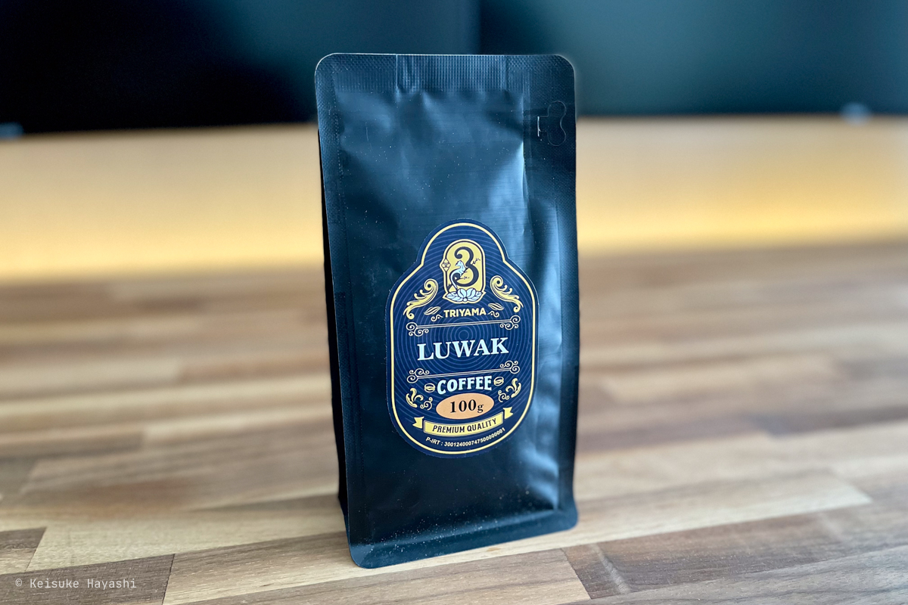

舌が観光地仕様になっている今と日本に帰ってからでは味の感じ方が違うだろうから自分用にメス版を 100g 購入した（7,000 円ぐらい）。
店の外観・内装もそうだったが、デザインがカッコ良い。良い意味でバリらしくないところであった。

## 棚田の見えるカフェ

それから車で 1 時間半ぐらい揺られているとウブドに着いた。
朝は晴れていたのに突然雲行きが怪しくなりカフェに着く頃にはスコールが降り始めた。

棚田といえば Tegallalang Rice Terrace が有名だが、入場料で 2,000 円ぐらいするらしく、それは高いなと思ったので A 氏オススメの Carik Terrace Warung というカフェに行った。

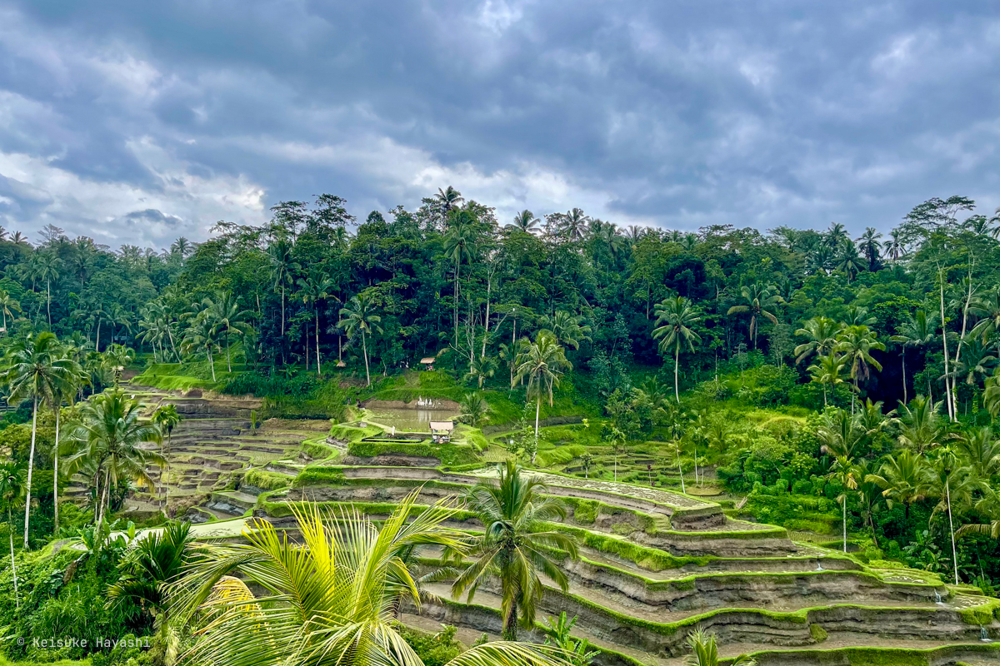

雨が降り注ぐライステラスは水の流れを観察できて面白かった。

## ティルタ・ウンプル寺院

昼食後にはブランコに乗ったりしてたくさん写真を撮ってもらうなどした（恥ずかしいのでここには載せないが）。

本日最後の目的地はバリ・ヒンドゥーの「聖なる泉の寺院」として知られるティルタ・ウンプル寺院である。
この寺院には水が湧き出ており[^4]、水の神様が祀られている。
実際に湧出している泉を見たが透明度が高く、神聖な場所になるのも納得した。

[^4]: A 氏曰く、一度だけうなぎを見たらしい。それぐらい綺麗な水

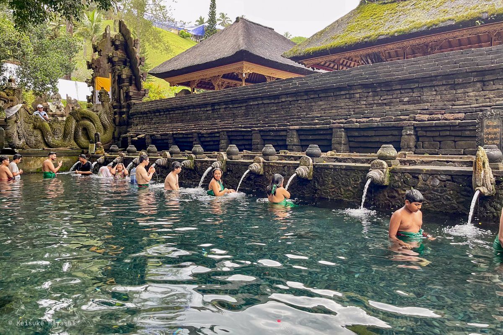

実際に沐浴する人々を見た。現地の人だけではなく、外国人も半数ぐらいいた。
A 氏に聞いたところ、**沐浴には吹き出し口から水を浴びる順番があり、しかもいくつかの吹き出し口は死者のための水だったりするのでしっかり下調べして行った方が良いかもしれない。**
身を清めようと行ったにも関わらず変に祟られるのも怖い。

寺院が閉まるのは 18 時ごろと結構早い。もう少しゆっくり見ていたかったなあ。
そこから今日泊まる予定の [The Westin Resort & Spa Ubud, Bali](https://www.marriott.com/en-us/hotels/dpswr-the-westin-resort-and-spa-ubud-bali/overview) に向けて出発した。

## ジャングルの中のインフィニティプール

次の日、部屋のバルコニーから見えるプールが気になっていたので水着に着替えて行ってみた。
海の近くだったり、ビルの上にインフィニティプールがあるのはよく見るけどジャングルの側にあるというのはなかなか珍しい気がする。

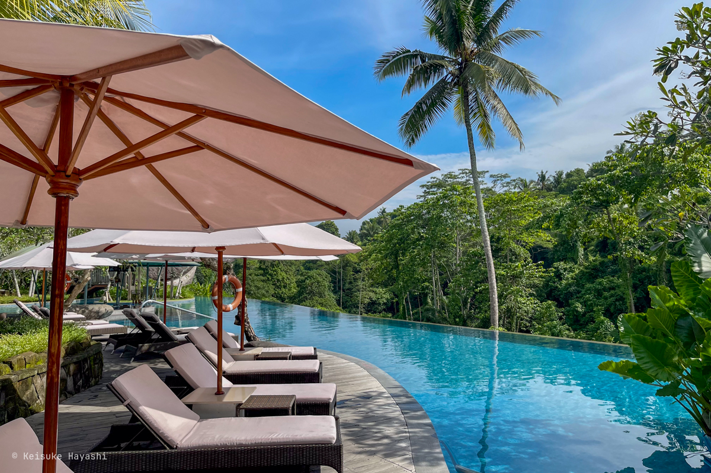

レイトチェックアウトの時間ギリギリまでプールでぷかぷか浮かんでいた。

## 山から海へ

バリに来てから 4 日目となる今日はウブド市内を観光してから 1 日目に宿泊したヌサドゥアの方へ戻るプラン。
移動時間だけでも 2 時間ぐらいはかかってしまう。

ウブド市内ではココナッツジュースを飲んだり、ウブド王宮を見学したりした。

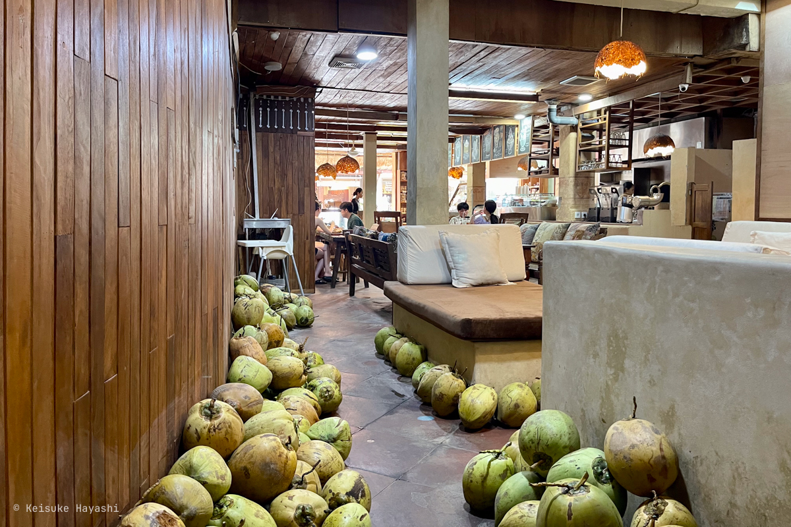

ココナッツの実に直接穴を開けて飲むタイプのジュースは初めてだったが、渋くてあんまり美味しくなかった。
市販されている白くて甘いココナッツジュースとは全く別物ということを知れて良かった。

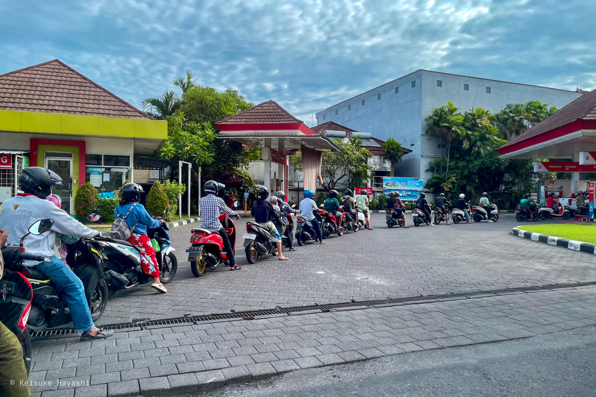

ウブドからヌサドゥアまではすごい渋滞だった。
日本の交通ルールでは考えられないような動きをする車やバイクが多くて、見ているだけでもけっこう楽しめる。

また、バリ島ではガルンガン[^6]というバリ・ヒンドゥーにとって大切な祝日を明日に控えていたこともあり、町中に日本の七夕の竹飾りに似たようなオブジェクトが立てられていた（ペンジョールというらしい）。
各家庭ごとにこだわりがあるようで微妙にデザインが異なる。そんなことは知らずに来たのでなんだかラッキーに感じた。

[^6]: 日本でいうとお盆のような祭礼の日

このままホテルに戻るには早すぎるのでスミニャックの方へ寄ってビーチを散歩することにした。
海沿いを歩いていると Mano Beach House という良さげなビーチクラブがあった。お腹が空いたのでここで夕食をとることにした。

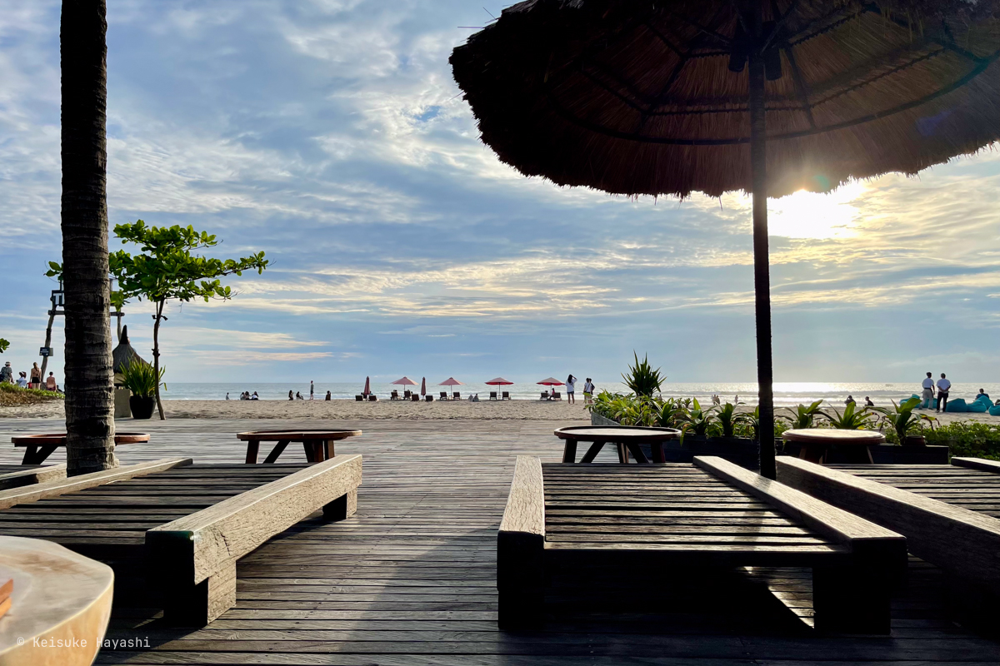

Yogibo みたいな椅子に寝転がり海と空と夕日を眺めていると誰かが何も急ぐ必要はないんだということを教えてくれる。
陽が落ちてあたりが薄暗くなるまでぼーっとしていた。

## The Ritz-Carlton, Bali

バリ島最後の宿泊場所として選んだのは [The Ritz-Carlton, Bali](https://www.ritzcarlton.com/en/hotels/dpssw-the-ritz-carlton-bali/overview)。
まず、部屋に行くまでが遠過ぎてクラブカー（ゴルフカート）で送迎してもらった。この敷地内では基本的にクラブカーで移動するらしく、その度に電話で呼ばないといけない。

部屋に着くとアップグレードされたらしく、今まで泊まったことのあるどの部屋よりも広くて驚いた。
そして、窓を開けるとこのプールである。少年の時の心を思い出させてくれる。

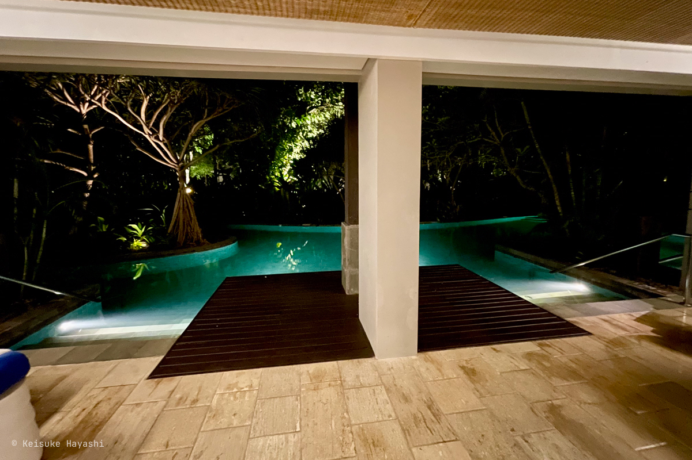

次の日にロビーから撮った景色。真正面にメインプールがある。
時間の関係で残念ながら 30 分しか居られなかった（お土産を買いに [バリ・コレクション](https://bali-collection.com) に行ったりしたので）。

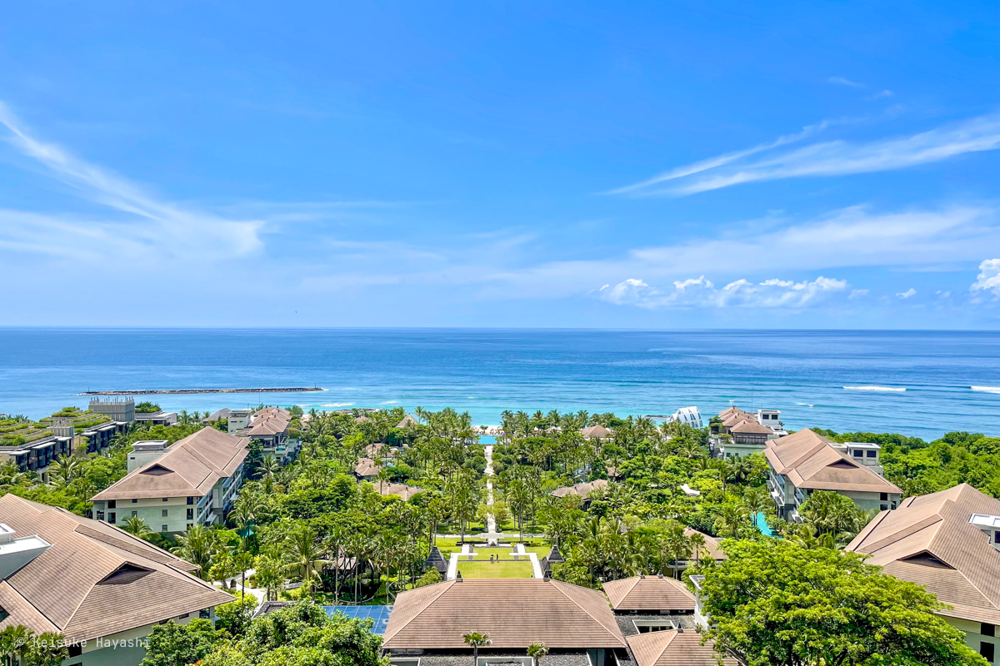

今度来るときはホテルから一切出ないでのんびり過ごしたい。

今回泊まった全てのホテルに共通していたことに従業員のホスピタリティの高さがある。
なんと言って良いか、私は疑り深い人間なのでどんなに親切にされても何か裏があったりするのではないかと考えてしまうのだが、ここではそういったことを全然感じなかった。

使い古された表現だが、命の洗濯をするためにバリ島を訪れるのは良い選択だと思う。

## 夕陽とケチャ

小学生の頃、音楽の授業でケチャのビデオを見て奇妙で面白い音楽だなとみんなで笑った記憶がある。
バリ島のことを調べているとケチャがバリ島の伝統芸能であることを知り、点と点が繋がったような気がした。

バリ島にはケチャを観られる場所はいくつかあるが、ロケーションの良さそうなウルワツ寺院に行くことにした。
チケットは現地に行って売り切れていたら最悪なので KKday であらかじめ購入しておいた。

開演は 18 時から。しかし、全席自由席なので良い席からすぐに埋まってしまうらしく開場する 17 時には列に並んでいた。
なんとか海と夕陽が見える良いポジションを確保して安心した。
しかし、西日がダイレクトに当たるためとんでもない暑さだった。
幸いにも日傘を持っていたため熱中症にはならなかったが、**必ず日傘と水は持って行ったほうが良い。**

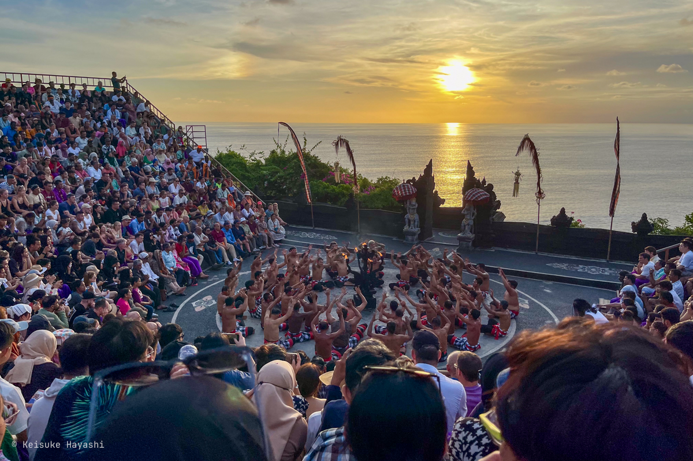

18 時を過ぎると軽快なチャッ、チャッという掛け声とともに半裸の男たちが正面にある割れ門から入ってきた。
一応ストーリーがあるらしく、入場時に日本語で書かれた紙を見ながらこれは何を表している場面なのか考えながら観覧した。

30 分ほど経つと夕陽と地平線が重なり、ケチャと観客の熱気が相まって圧巻の光景だった。
ずっと決まった演舞をするのではなく、突然観客席に演者が乗り込んできたり、各言語を織り交ぜて盛り上げてくれたり（コールアンドレスポンスで大勢のインド人が反応していて驚いた）と終始良い雰囲気だった。
交通の便が悪いのがネックだが、それを考慮しても行って良かった。

## スパで旅の疲れを癒す

5 日間のバリ旅行はあっという間だった。
時間は過ぎ去っても身体の疲れは蓄積される一方なので疲労を癒すために旅の最後にスパに行くことにした。

バリ島には無数のスパがあり、どこが良いのかは悩んでいたが、A 氏に聞いたところ　[Kupu Kupu Mas Spa Jimbaran](https://kupukupumasspa.com) というスパがリーズナブルで技術も高くオススメらしい。

それなら間違いないということで、3 日目の段階で予約していた。

1 時間 3,500 円ほどで全身のオイルマッサージをしてもらったが、体感できるほど身体が軽くなった。
バリに滞在している間は毎日行っても良かったなあと後悔した。

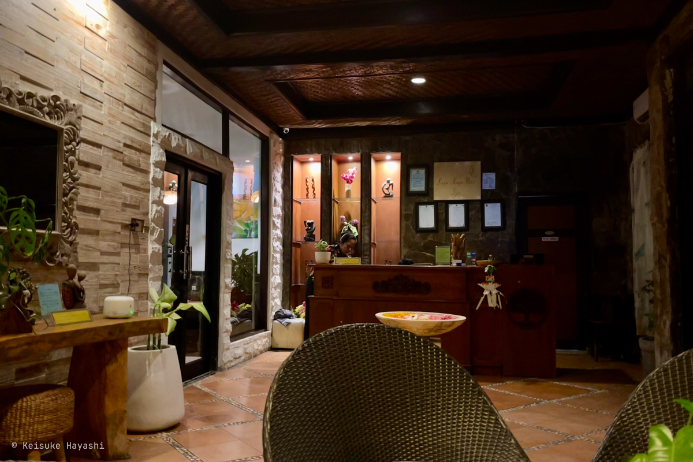

ウルワツ寺院では大量の汗を書いたのでマッサージ終わりにシャワーを浴びれてさっぱりした。
旅の最後にスパを入れる計画は旅行の中でも定番になりそう。

まだバリに居たいという気持ちと早く日本に帰りたいという気持ちがせめぎ合っているが、日常に戻らなければいけない。
また来る機会があれば今度はヴィラでのんびり過ごしたい。

## 後日談

日本に帰ってからというもの 1 週間ほど下痢が続いて辛かった。
いわゆる「バリ腹」になってしまったようだ。
どの食べ物が原因というよりも元々の胃腸の弱さに加えて、辛い料理をたくさん食べたり、疲労が溜まったりしたのが原因かもしれない。
幸い日本に帰ってから症状が出てきて良かった。

バリ腹が治る頃にはインフルエンザ A 型を発症した。これも免疫力が落ちていたことが原因だろう。
この時期は B 型が流行しているから、どこで A 型のウイルスをもらってきたのか。

いずれにせよ、体力をつけないと旅行をフルに楽しめないから、毎日デスクに鎮座していないで体力作りを計画的に進めないとなあ。
