最近はいろんなところに行く（行かされる？）機会が多くなり、いつの日にか思い出したい風景が増えてきた。
人生は思い出作りという名言があるように、人は誰でもその人の思い出を通して人生を再体験できる。
その際にリアルなイメージがあるかないかは大違いである。

今までは高校生のころに買った [Canon EOS 60D](https://global.canon/ja/c-museum/product/dslr805.html) という重い一眼レフ（675g）を愛用していた。
ただ、近頃はその重さがネックとなって気軽に持ち出す機会が減っていった。
これでは未来に受け取るべき思い出の配当がだんだん削られているのと同じなので、ちょっとした散歩でも持ち運べるような小ぶりなカメラが欲しくなった。

## Sony α7C II と Sonnar T* FE 55mm F1.8 ZA

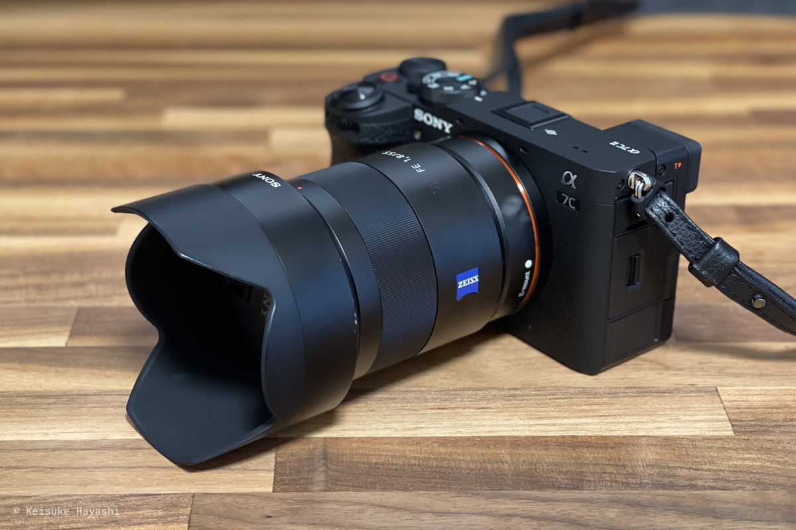

そこで購入したのが Sony のミラーレス一眼カメラ [α7C II](https://amzn.to/4jfniOj)である。
**見た目はコンパクトだが、フルサイズセンサーを搭載しており有効画素数も最大 3,300 万画素と十分な性能だ。**

何より 429g と軽くてずっと首に掛けていてもそこまで気にならない。

1 本目のレンズとしては [Sonnar T* FE 55mm F1.8 ZA](https://amzn.to/4cljdWD) を購入した。

メインでは街中や日常のスナップショットを撮っていきたいと思っているので焦点距離をどれくらいにするか悩んだ。
35mm ぐらいが一番使い勝手は良さそうだが、お気に入りの写真を見ると 55mm 前後のレンズが多かったということもあって 55mm にした。
まだ使いこなせてないけど良い感じだ。ZEISS のロゴが入った見た目もカッコ良い。

[ストラップ](https://amzn.to/4ckn7zc) は Sony 純正のものにした。
材質が本革なので高級感もあって気に入っている。
ストラップはロゴが悪目立ちするパターンが多い中、これはロゴが目立たないのが良い。
手を滑らせてカメラを落とすのが怖いので常時首に掛けている。

## 他に購入したもの

今回はカメラを新調したということもあって他にも色々購入した。

### ハクバのドライボックス

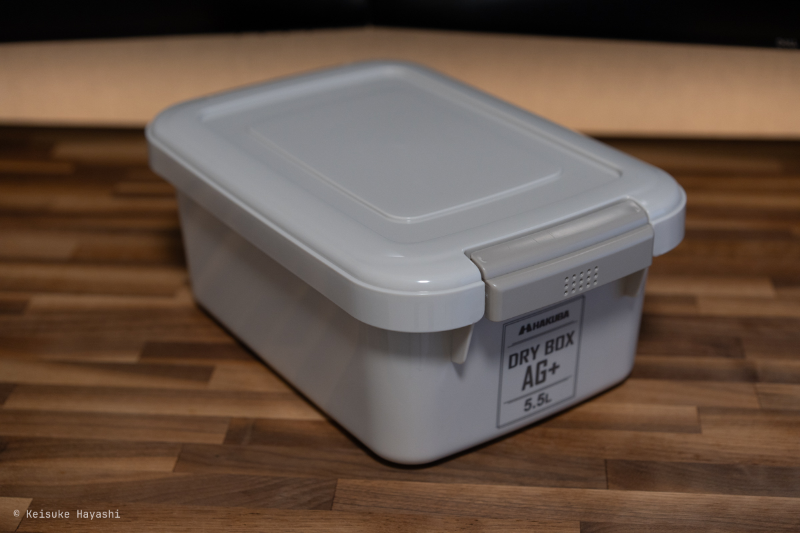

カメラの保管用に [ハクバのドライボックス](https://amzn.to/3DVjkeZ) を買った。

防湿庫を買うべきか悩んだが、見るからに大きいのと、コンセントを使うのがどうしても嫌だったため見送った。
やっぱりコンパクトは正義だ。

### 東洋リビングのモバイルドライ

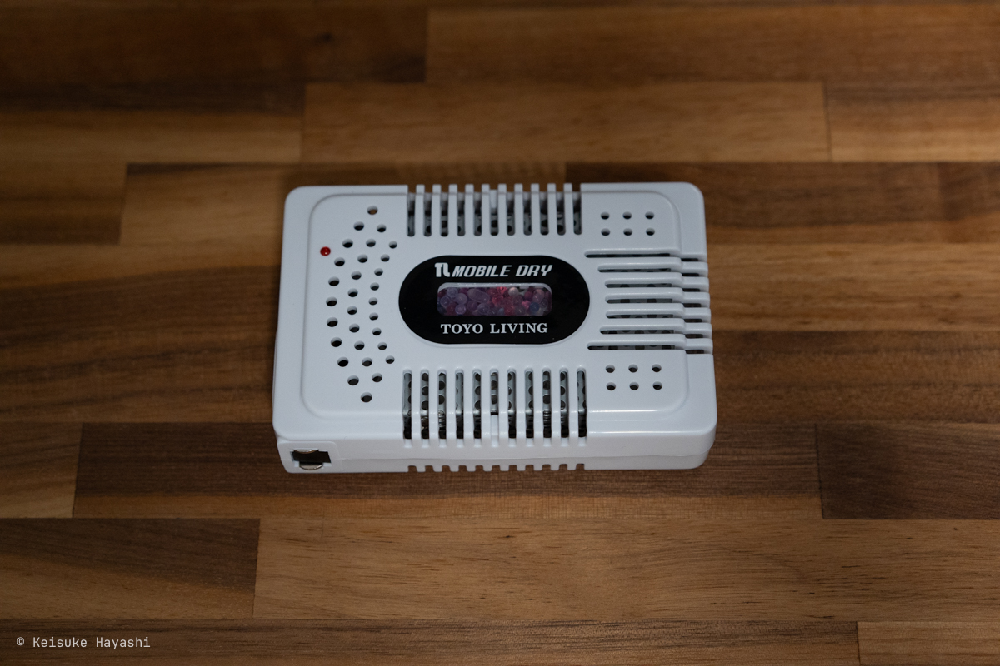

頻繁に使っていれば自然とカメラは乾燥するのでカビることはないと思うが、念の為、気休めに [東洋リビングのモバイルドライ](https://amzn.to/4jjqf0t) を買った。

モバイルドライがすごいのは**コンセントに挿すだけで何度でも乾燥剤として使える**点である。
使い捨ての乾燥剤をストックするのはちょっと面倒くさいのでこれはありがたい。

### Sony GP-VPT2BT

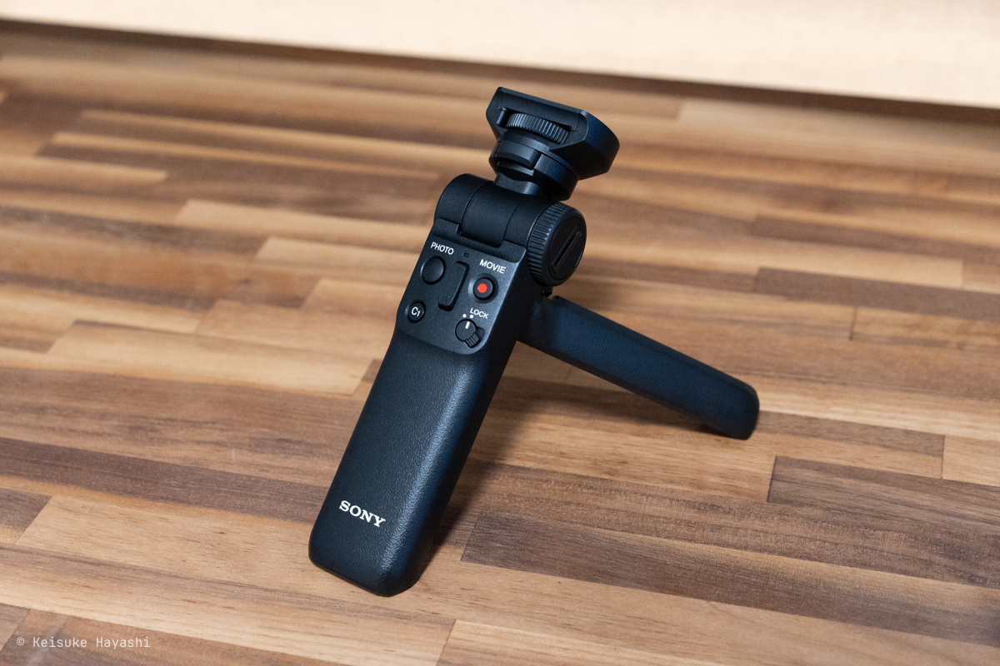

自撮りや簡易的な三脚として Sony の [Sony GP-VPT2BT](https://amzn.to/4iWdR6V) を購入した。

Bluetooth 対応によりケーブル不要で取り回しが容易なのが素晴らしい。
ただ、55mm のレンズだと自撮りが厳しかった……。
いずれ広角レンズを買わないとだな。

### MC プロテクターと PL フィルター

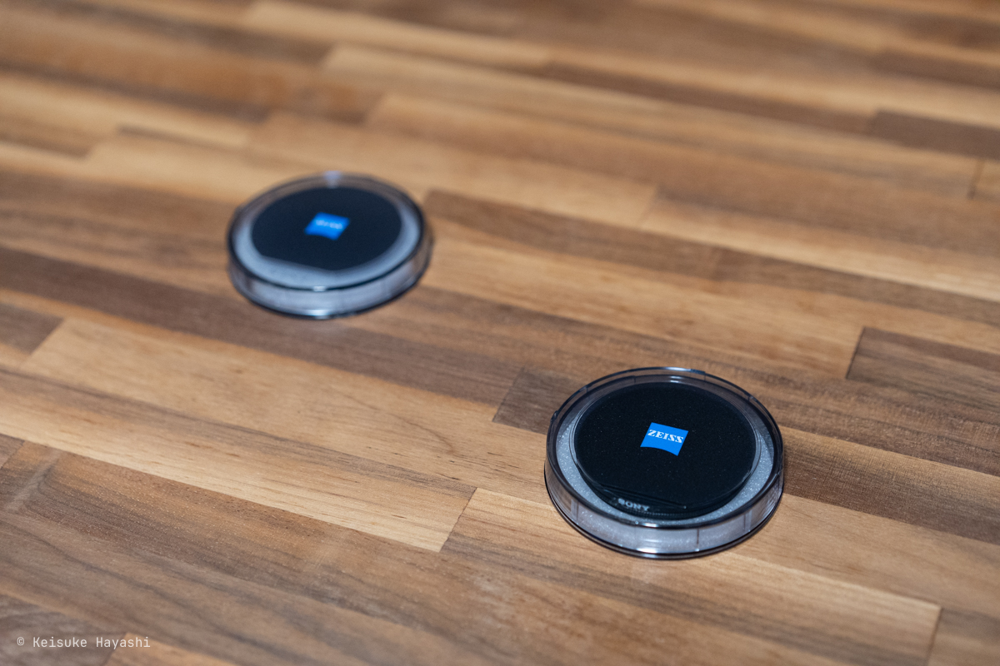

[MC プロテクター](https://amzn.to/41WC1rQ) と [PL フィルター](https://amzn.to/3FUAr17) はいずれも Sony のものを購入した。

基本的にレンズ保護のために MC プロテクターを装着しているが、晴れた日や海を撮るときに PL フィルターは活躍してくれることでしょう。

### ARC'TERYX Mantis 2

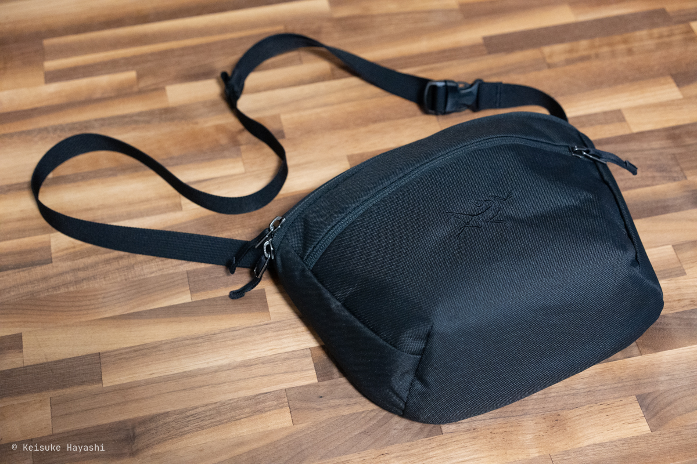

ARC'TERYX の [Mantis 2](https://arcteryx.jp/products/mantis-2-waist-pack?variant=47677826793703) というモデルである。
せっかくコンパクトなカメラを買ったのでそれに合うようなバッグを探していたときに見つけた。

レンズを装着した状態でピッタリ入る。
もう少しレンズが長くなっても問題なさそうだ。
ただし、替えのレンズは入りそうにない。
家を出る段階でその日の気分によってレンズを使い分けることになりそうだが、それも悪くない。

## ぶらぶらと散歩

早速、近所を散歩がてら写真を撮ってみた。

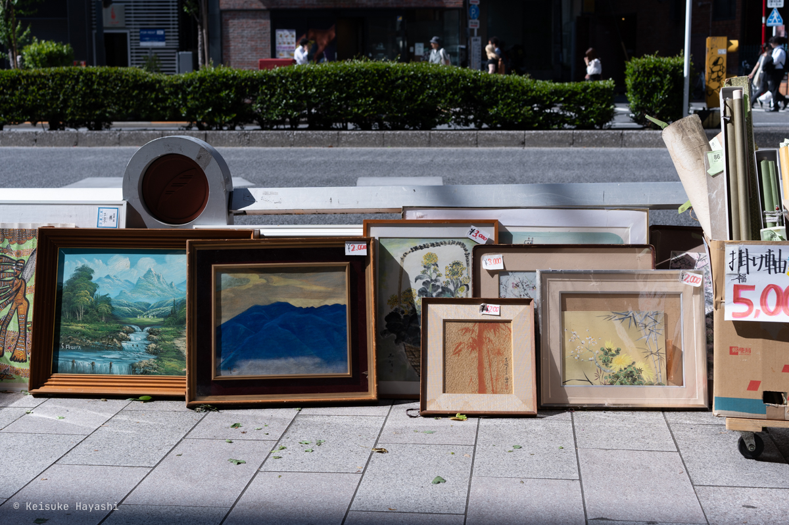

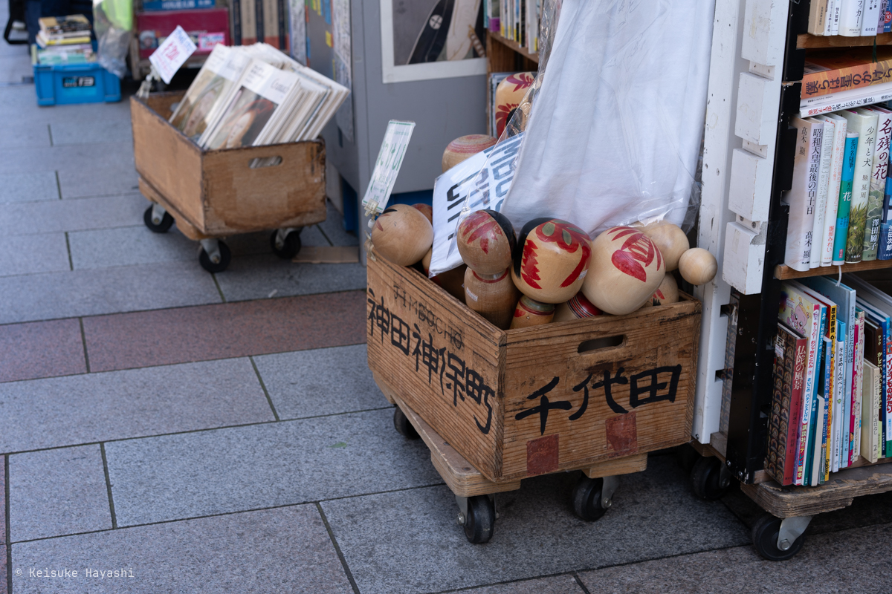

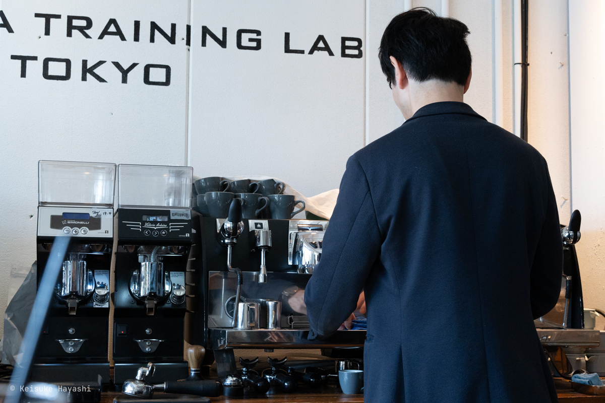

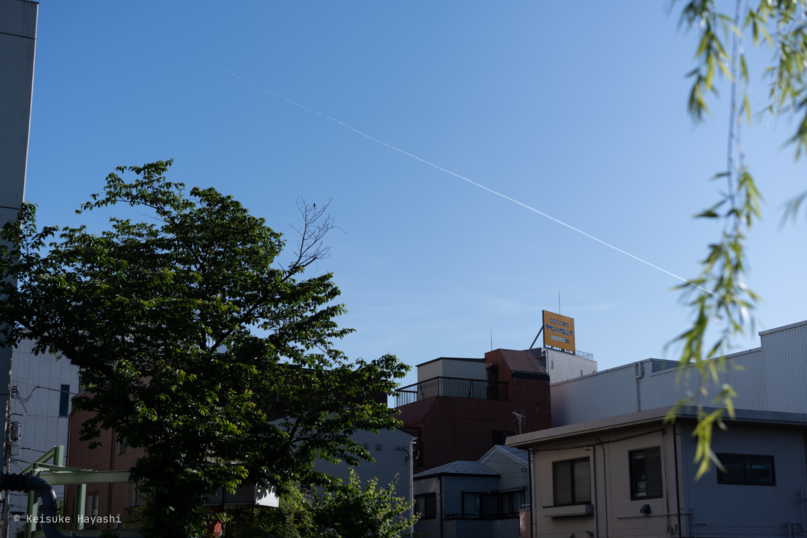

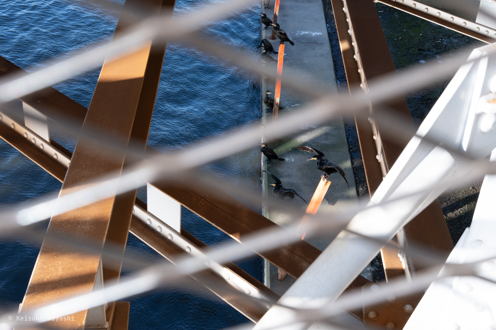

もっと素直に世界を見ていきたい。
