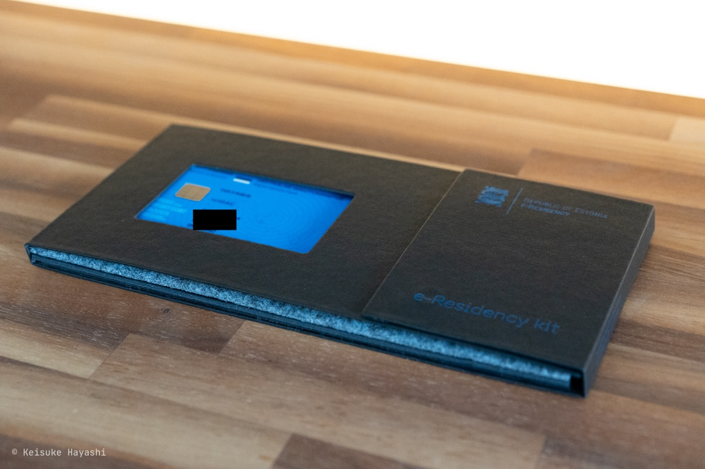
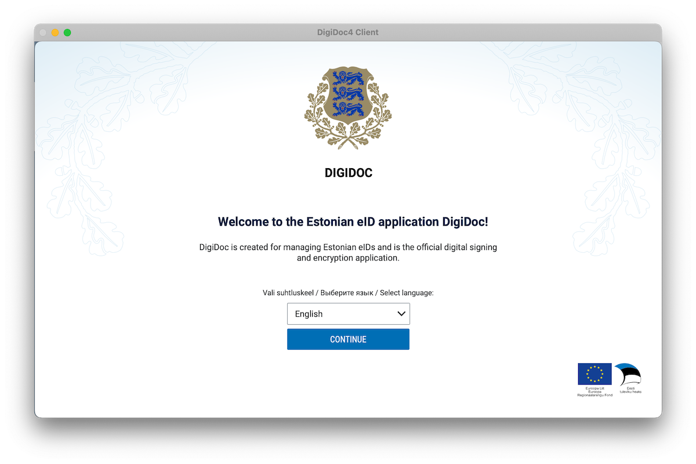
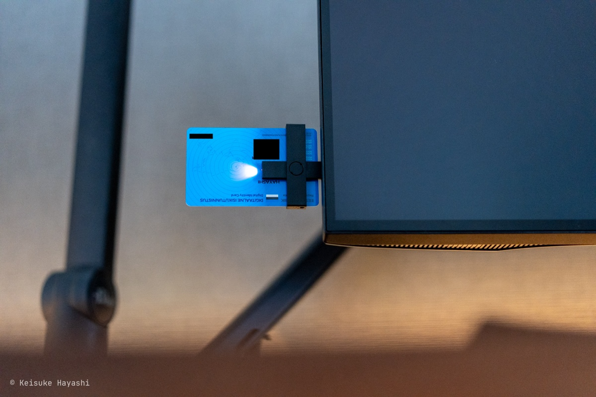
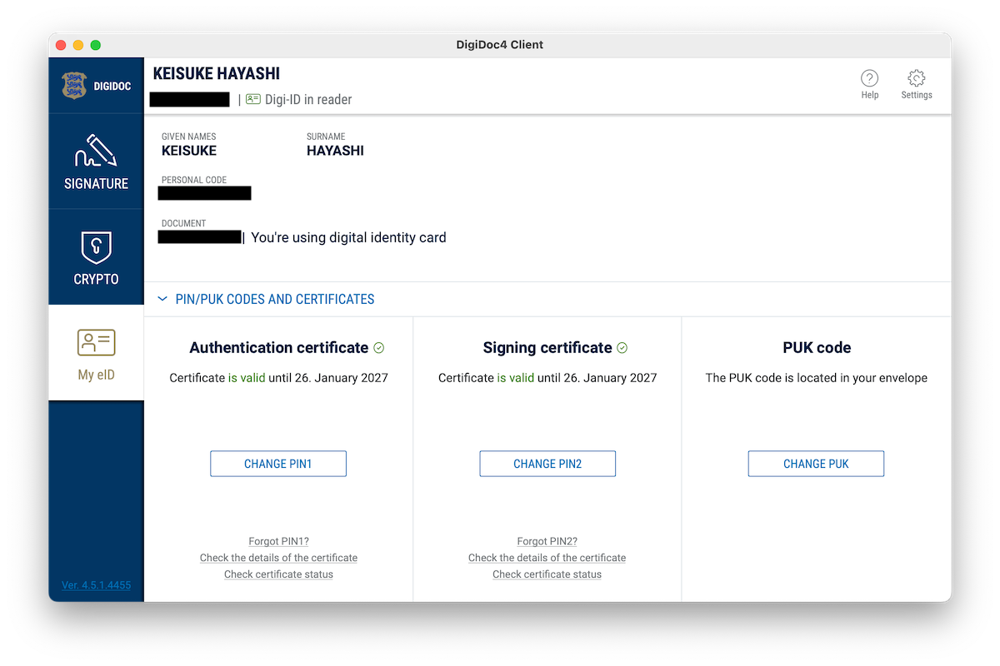

エストニアの電子国民になったのは 2021 年の 6 月ごろ。
それから 3 年が経った。

電子国民になったからと言って特に恩恵を自動的に受けられるわけではない。
ただし、来るべきときのために何ができるのかは最低限まとめておきたい。

## 電子国民になるまでの経緯

エストニアは北ヨーロッパに位置するバルト三国の 1 つで、自然の美しさや豊かな歴史、先進的な IT 技術で知られている。
特に IT に関しては世界でも最も進んでいる国の 1 つで、**結婚と離婚以外の手続きは全てオンラインで行える**というから驚きだ。
ある意味、日本が目指すべき国家だと思う（マイナンバーはエストニアを参考にして作られたらしい）。

そして、エストニアは世界中の誰でも（審査はあるけど）エストニアの電子国民（e-residency）として登録してデジタル ID を取得することができる。
このデジタル ID を通じて、オンラインでのさまざまなサービスを利用したりビジネス活動を行うことが可能となる。

電子国民という響きは、未知の可能性と新たな冒険を予感させる。
物理的な国境を超え、デジタルの世界で国籍を持つというアイディアは、まるで未来の物語の一部になるような感覚を覚える。

といったわけで、取得しようと思った時点では特にビジネス的な側面を理由とはしていなかった。
どちらかというと**電子国民という響きにロマンを感じてとりあえず取得しておこうかなぐらいの気持ちで申し込んでみた。**

オンラインの手続きは Web サイトから行える（[申し込みフォーム](https://www.e-resident.gov.ee/become-an-e-resident)）。
いくつか申請理由を書かなければいけないのは面倒だが審査があるのでちゃんと書いた。

申請料金は 120 ユーロだった。
当時のレートだと 1 ユーロ 130 円ほどだったから 15,600 円かかった。
今は円安だから 1 ユーロ 170 円とすると 20,400 円もかかる。

申し込んでからしばらくするとメールに返信があり、申請理由に対して深掘りされた。
例えば、「エストニアで会社を設立する予定はありますか？その場合、どのような分野で事業を立ち上げるのか、また、どのような商品やサービスをどのようなグループや国に提供するつもりなのか具体的に教えてください」といった具合に。
結構しっかりと精査されているということがわかった。

それから約半年後に審査が終わって e-residency の ID 発行が決まった。
受け取り時に指紋採取と面接（英語）があるため明治神宮外苑の近くにあるエストニア大使館に行った。

こうして、晴れてエストニアの電子国民になれた。
指紋採取が完了して最後に ID カードが入ったケースを直接渡される。
大使館の人は良い人だった。

## DigiDoc4 Client を使ってみる

電子国民になった実感を持つために [ID-software](https://www.id.ee/en/article/install-id-software) というクライアントソフトをインストールしてみる。
DigiDoc4 Client というソフトを起動すると以下の画面が表示される。

以降の処理は ID カードが必要になるため、付属のカードリーダーを使って USB ポートに差し込む。
ちゃんと差し込まれたらライトが光る仕様。

すると、このように e-residency に関する情報を照会できる。
また、電子署名もこのソフトを使って行える。

## その他にできること

エストニア電子国民になるとわずか数時間でオンライン上で簡単に会社を設立できる（[参考](https://learn.e-resident.gov.ee/hc/en-us/articles/360000624838-5-steps-how-to-start-a-company-online)）。
さらに年次報告書の提出や税務申告もオンラインで行えるため、国際的なビジネスを展開する上で非常に便利である。

だが、言葉の壁があるのと、税務関係が複雑になるので法人を設立するのはある程度勉強してから行ったほうが良いかも（[参考](https://note.com/gernika/n/ncefbe7f5240e)）。
税制上の有利さを考えると、もしフリーランスとして法人を設立するならエストニアも選択肢に入ってくる。

もう 1 つ興味深いメリットとしてデジタルノマドビザの取得が挙げられる。
**エストニアは、リモートワーカーやフリーランスのためにデジタルノマドビザを提供**しており、これによりエストニアで合法的に長期滞在しながら働くことが可能になる（[参考](https://www.e-resident.gov.ee/nomadvisa)）。

最大 1 年間エストニアに滞在しながら働けるのである意味ワーキングホリデービザと同じようなものかもしれない。
IT エンジニアという仕事柄、基本的にインターネットに繋がる環境とパソコンさえあればどこでも仕事はできるので正直利用してみたい。
エストニアを拠点にヨーロッパを移動しながら仕事をするというのも夢がある。

## さいごに

電子国民になるのはそこまでハードルが高くないのでとりあえず取ってみるのはおすすめ。
実際に権利を行使しなくても話のタネにはなるし、将来的に何か新しいプロジェクトやビジネスを始める際の選択肢が広がる。
エストニア、ぜひ行ってみたい。
