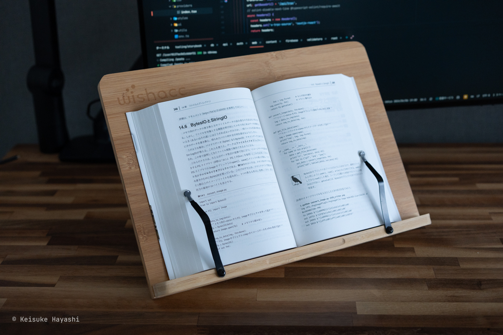
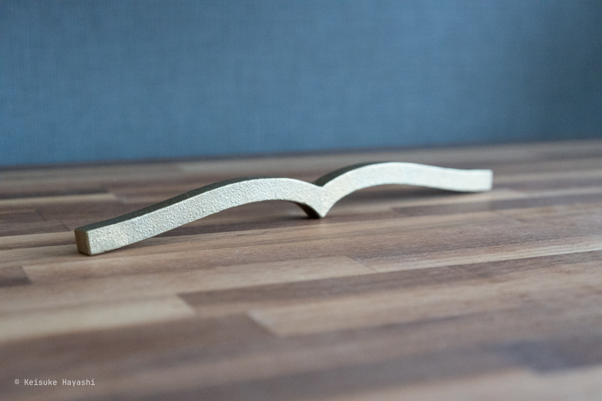
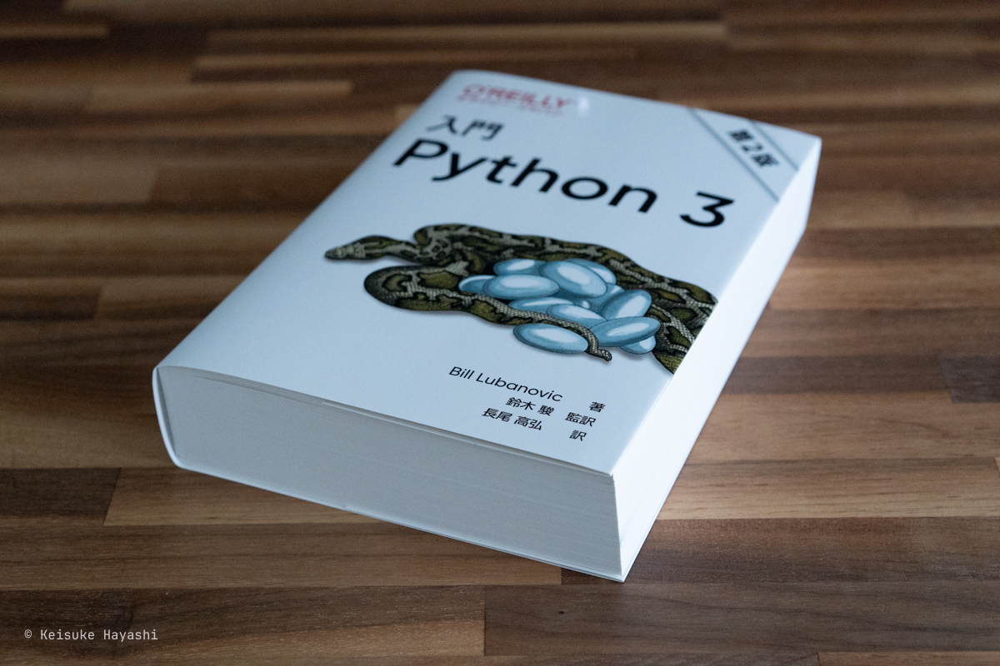
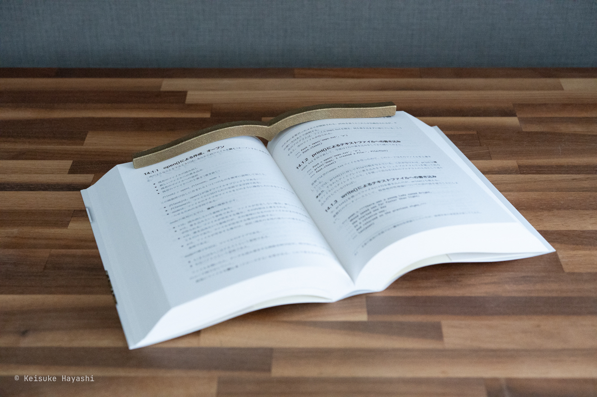
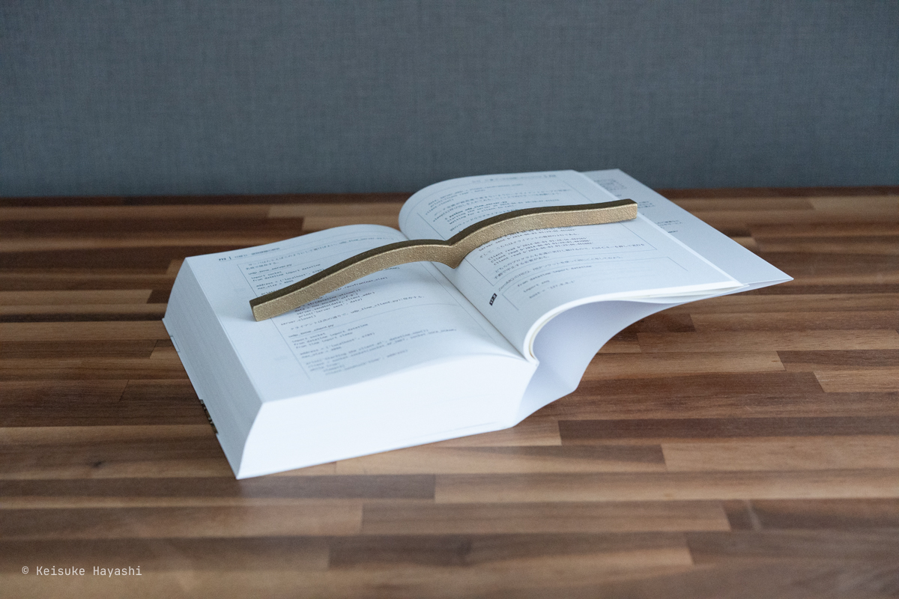

技術書を読んでいると動作確認したり、紹介されている Web ページを開いたりしたくなるときがある。
そのような場合、分厚い技術書を手で抑えながらタイピングするのはなかなか難しい。
身近なものを文鎮代わりにする方法も試したが、滑って本が閉じてしまうことが多々あり、地味にストレスだった。

そこで 3 年ほど前に以下のブックスタンドを購入した（[Amazon](https://amzn.to/4iZJmNo)）。

これでひとまず目的は達成した。
しかし、収納するときに嵩張るのでもっとスマートな方法がないのかと使うたびに思っていた。

ただ、そんな不満も毎回ブックスタンドを組み立てるたびに薄れていった。

時は流れて 2024 年。
ネットサーフィンをしているとコクヨから [本に寄り添う文鎮](https://amzn.to/3FU7diN) という今までありそうでなかった文鎮が発売されたことを知った。
まさにこれが今まで求めていたものだ。
すぐに Amazon で購入し、次の日には届いた。

早速、手元にある技術書の中で最も分厚いオライリーの [入門 Python 3](https://amzn.to/3FWRiQJ) で試してみる。

この分厚さでも問題なく文鎮としての機能を果たしている。

ただ、ページ中盤では文鎮を置かなくても本は開きっぱなしになることが多いので文鎮の必要性は低い。
問題は本の序盤と終盤である。

ページ上部に文鎮を置くと下部が膨らんでしまうのでちょっと見にくいが真ん中に置くと安定する。
文鎮の置き方によってはもっと安定する方法がありそうなので模索してみる。
