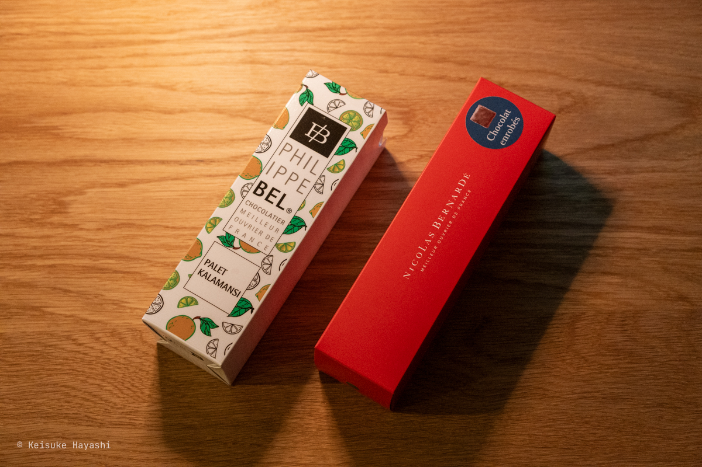
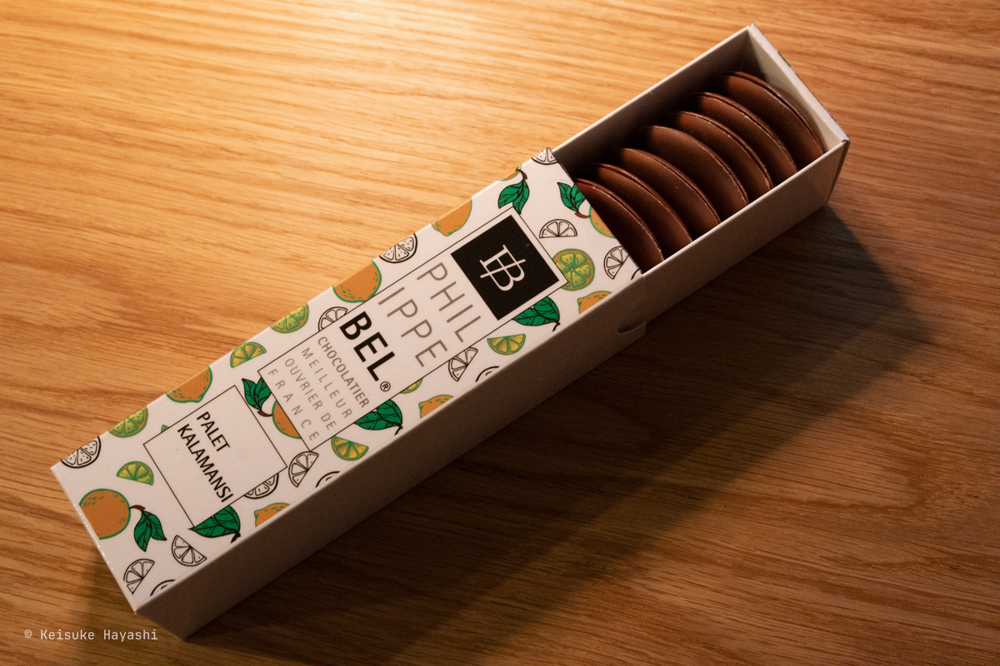
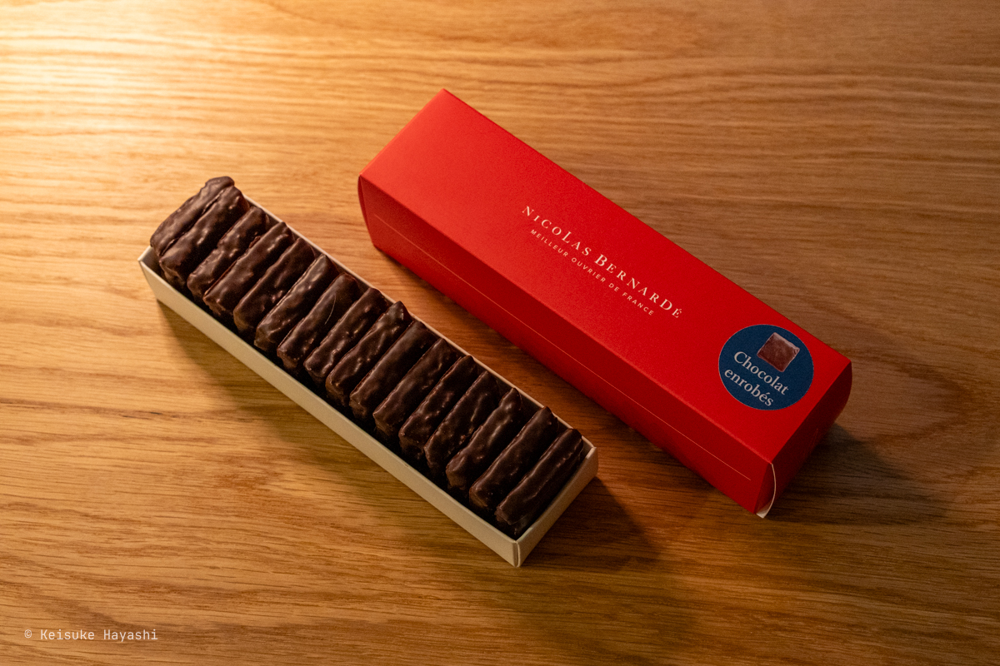
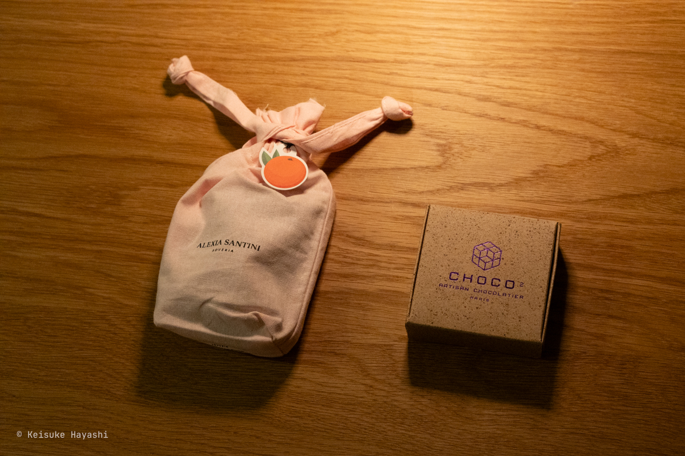
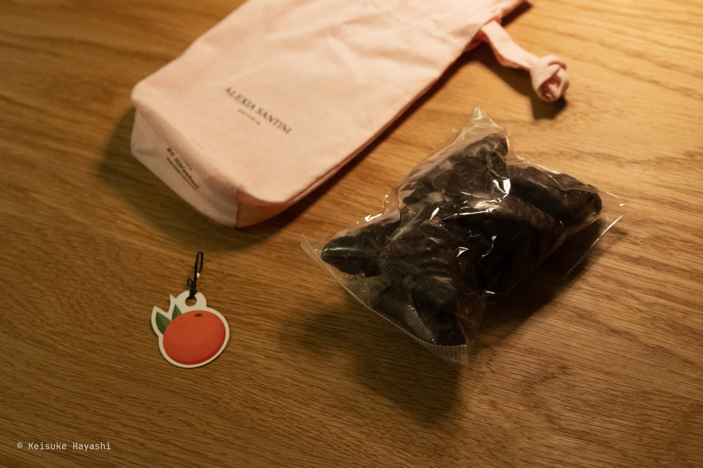
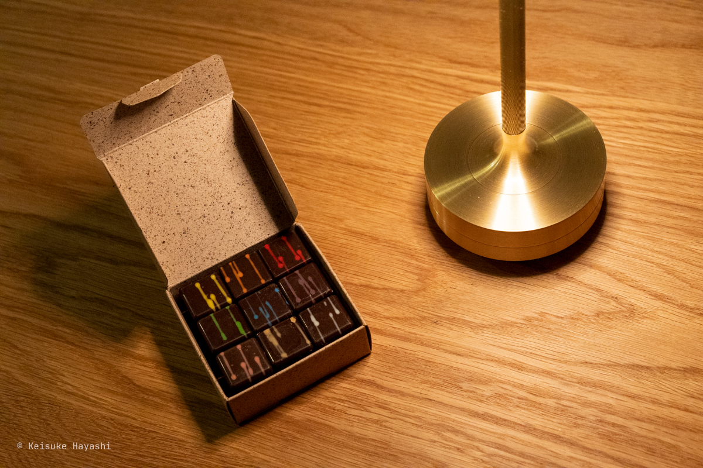
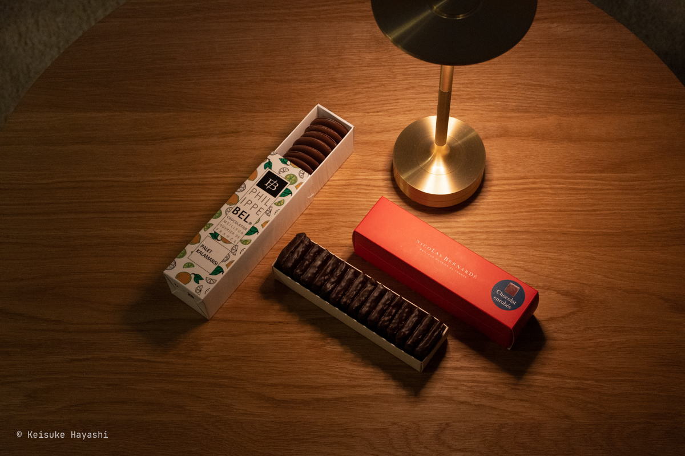

今年もありがたいことに恋人から色んなチョコレートをもらった。
去年の記事は[こちら](/posts/p18vcqd)。

お互いにチョコレートを愛してやまないので、バレンタインデーは「普段なかなか手が出せない高級チョコを堂々と楽しめる日」として定着している。
当然ながら、私がすべて独り占めするわけではなく、毎日のコーヒータイムに 2 人でじっくり味わっている。
むしろ、分け合うことで美味しさも 2 倍になる。

## 感想など

| ブランド                                             | ひとこと感想                    |
|--------------------------------------------------|---------------------------|
| [Philippe BEL](https://chocolatphilippebel.fr)   | カラマンシーがカカオの味を想像以上に引き立てている |
| [NICOLAS BERNARDĒ](https://nicolas-bernarde.com) | ザクザクとした食感が楽しい。不思議なクッキー生地  |
| [ALEXIA SANTINI](https://www.alexiasantini.com)  | オレンジを丸ごと味わっているような濃厚さ      |
| [CHOCO 2](https://choco-au-carre.fr)             | 1 個ずつ味が違うので毎回楽しみがある       |
