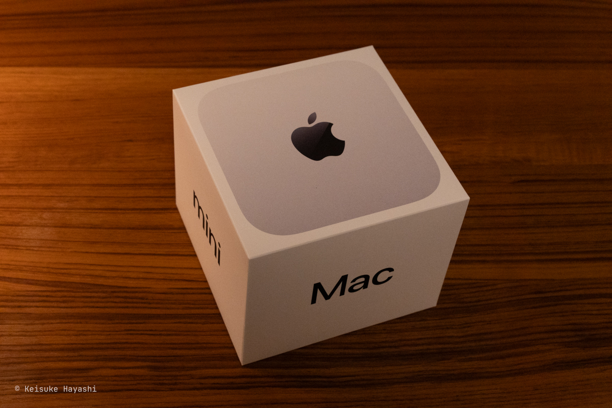
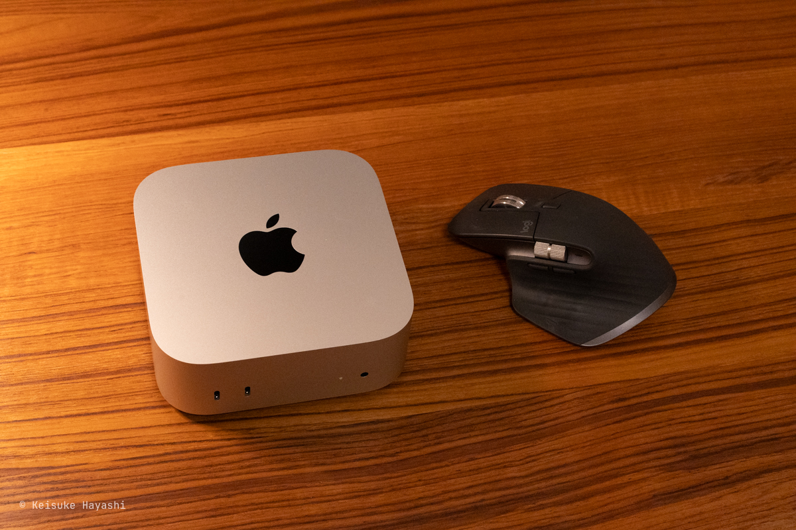
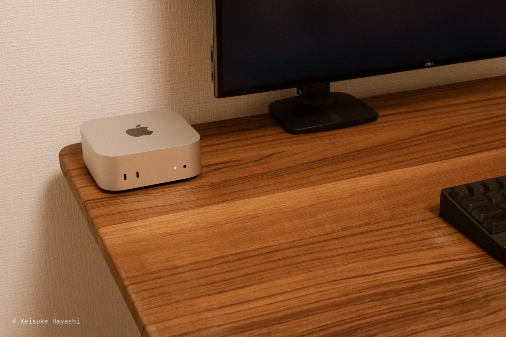
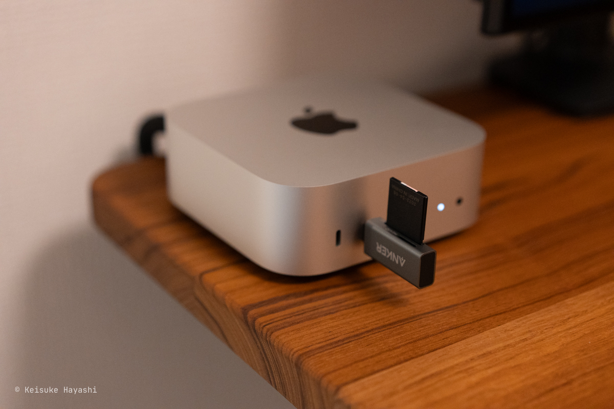
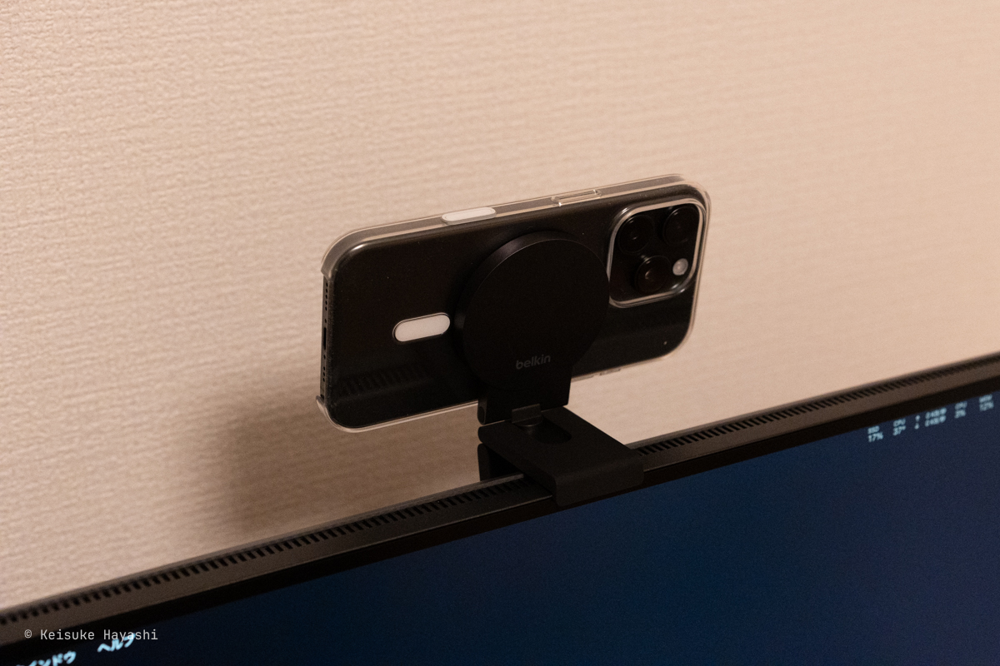

先日 M4 チップが搭載された Mac mini を購入したので所感を書いていく。

## Mac mini のスペック

今回購入した Mac mini のスペック ↓

- チップ: Apple M4 チップ
- メモリ: 24GB ユニファイドメモリ
- ストレージ: 512GB
- 価格: 約 148,000 円

デフォルトだとメモリは 16GB だが、IDE を開きながら作業するとちょっと心許ないので 24GB に変更した。
それ以外は特にオプションを追加していない。

Amazon で購入したため、Apple 公式で買うよりも 6,000 円ほど安く買えた。
分割払いをしなければ Amazon で買った方がポイントも付くし、良いかもしれない。

ただ、Amazon には 10Gb Ethernet のオプションがなかったため、そこが残念なポイント。
**細かくオプションを付けたい場合は Apple Store で買うべし。**

## もう Mac mini で良くないか？

**Mac mini をしばらく使ってみた感想としては、もう MacBook は要らないのでは？というのが正直な感想である。**
もちろん、万人がそうだとは限らないが、一定の人には当てはまると言える。

より具体的に書くと、以下の項目すべてに該当する人は MacBook ではなく Mac mini の方が向いている。

- 外付けキーボードを愛用している
- 外付けマウスを愛用している
- 外付けディスプレイを 1 枚以上使用している
- カフェなど、外出先で作業しない
- 仕事用のノート PC はある

むしろ、今まで使いもしない内蔵キーボードとトラックパッド、Retina ディスプレイにこだわる必要はなかった。
それらが削られたおかげで、このスペックとしてはかなり安価にデスクトップ PC を購入できる。

ちなみに現在、最も安価な MacBook Pro は 248,800 円である。
しかも、16GB ユニファイドメモリで、ストレージは 512GB、ディスプレイは 14 インチと中途半端なスペック。
昨今の目まぐるしい PC の進化を考えると、**外付けできるものは長く使い、PC は数年で買い替える方が得策**だと考える。

何より、Mac mini の良いところは、その可愛らしい佇まい。
MacBook はいかにして目立たないように収納するかを考えていたが、Mac mini はそのままデスク上にあっても許せる（とはいえ、より良い収納方法があれば採用する予定）。

## Mac mini にあると便利な周辺機器

Mac mini は極限まで（というと言い過ぎかもしれないが）無駄を削ぎ落としているため、必要とあらば自前で周辺機器を用意しなければならない。

### SD カードリーダー

[Anker の USB Type-C 対応 SD カードリーダー](https://amzn.to/3RBh8MJ)である。
**Mac mini には SD カードの差し込み口はないため、こういったコンパクトなカードリーダーは必須。**
撮影した写真を移動させる際に重宝している。

### iPhone MagSafe マウント

MacBook にあって Mac mini にないものとしては、内蔵カメラがある。
基本的に仕事はリモートなので、急にミーティングが入り、Web カメラが必要になることがある（とはいえ、最近は顔を出さなくても良くなっているが、仕事によっては顔出しは必須だろう）。
そんなときのために、外付けの Web カメラが必要になる。

わざわざ、そのためにカメラを買うのは気が引けていたときに iPhone が Web カメラとして使えることを知った。
そこで購入したのが [Belkin の iPhone MagSafeマウント](https://amzn.to/3FVodFr)である。

これを使えば iPhone が簡単に Web カメラになる。
そして、**iPhone のカメラは MacBook の内蔵カメラよりも、はるかに高画質である。**
良い時代になったものだ。

### Apple Watch

MacBook には Touch ID が搭載されているが、Mac mini にはそれがない。
**毎回パスワードを入力するのは面倒臭いので、Apple Watch を使って Mac mini のロックを解除している。**

基本的にスリープ状態から復帰するときは、Apple Watch のロック解除で済むので、パスワードを入力することはほとんどない（まれに、パスワードの入力が求められる。条件は不明）。

## さいごに

まだ試していないが、iPad をメインディスプレイとして使えるっぽいので試してみたい。
それが不具合なく簡単にできれば、本格的にノート PC の代替になりそう（周辺機器を持ち運ばなければならない面倒臭さは置いておいて）。
